:::{.callout-tip icon="false"}
###  Learning Objectives

After completing this session, you will be able to:

- Describe how Git and GitHub integrate to support teamwork on shared projects
- Apply the principles of Git to track and manage changes of a project
- Perform each step of the Git workflow to edit files locally and sync them with a remote repository
- Create and configure Git repositories using different workflows
:::

## Introduction to Version Control

{fig-alt="Comic of a grad student naming a document 'final' before needing to iteratively revise resulting in a series of progressively less interpretable 'final' filenames" width="70%" fig-align="center" .lightbox}

Every file changes throughout the scientific process. Manuscripts are edited. Figures get revised. Code gets fixed when bugs are discovered. Sometimes those fixes lead to even more bugs, leading to more changes in the code base. Data files get combined. Those same files are split and combined again. In just one research project, we can expect thousands of changes!

These changes are important to track, and yet, we often use simplistic file names to do so. Many of us have experienced renaming a document or script multiple times with the disingenuous addition of "final" to the file name.

A better way: **version control**. Version control provides an organized and transparent way to track changes in code and files. This practice was designed for software development, but is easily applicable to scientific programming.

Benefits to using a version control software include:

-   **Maintain a history** of project development while keeping your workspace clean
-   **Facilitate collaboration** and transparency when working on teams
-   **Explore bugs or new features** without disrupting your team's work
-   and more!

The version control system we'll be diving into is Git, the most widely used modern version control system in the world.

#### With Git We Can Enhance Our Workflow: {.unnumbered}

- **Eliminate** the need for **cryptic filenames** and comments to track our work.
- Provide **detailed descriptions of our changes** through commits, making it easier to understand the reasons behind code modifications.
- Work on multiple **branches** simultaneously, allowing for parallel development, and optionally merge them together.
- Use commits to **access and even execute older versions** of our code.
- **Assign meaningful tags** to specific versions of our code.
- **Multiple individuals can work on the same analysis concurrently** on their own computers, with the ability to merge everyone's changes together.

### What Exactly are Git and GitHub?

::: {.panel-tabset}

#### What is Git?

**Git** is an open-source **version control** software

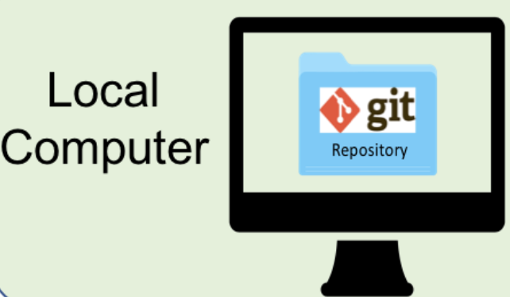{fig-alt="Cartoon of a desktop computer containing the Git logo" width="50%" fig-align="center"}

-  designed to manage the versioning and tracking of files and project history
-  **operates locally** on your computer, allowing you to create repositories and track changes
-  provides features such as committing changes, branching and merging code, reverting to previous versions, and managing project history
-  works directly with the files on your computer and does not require a network connection for most operations
- primarily used through the command-line interface (CLI, e.g. Terminal), but also has various GUI tools available (e.g. Positron IDE)

#### What is GitHub?

**GitHub** is an **online platform** and service built around Git

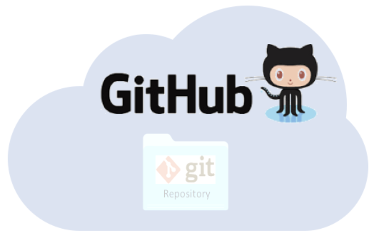{fig-alt="Cartoon of a cloud labeled 'GitHub' with the GitHub logo" width="50%" fig-align="center"}

-  provides a **centralized hosting platform for Git repositories**
-  allows us to store, manage, and collaborate on Git repositories in the cloud
-  offers additional features on top of Git, including a web-based interface, issue tracking, project management tools, pull requests, code review, and collaboration features
-  enables easy sharing of code with others, facilitating collaboration and contribution to open source projects
-  provides a social aspect, allowing users to follow projects, star repositories, and discover new code

:::

### How Local Files, Git, and GitHub Work Together

It can be daunting to understand the moving parts of the Git / GitHub life cycle (i.e. how file changes are tracked locally within repositories, then stored for safe-keeping and collaboration on remote repositories, then brought back down to a local machine(s) for continued development). It gets easier with practice, but here's a high-level overview of how things work:

#### What is the Difference Between a "Normal" Folder and a Git Repository?

Let's pretend that we create a folder, called `myFolder/`, and add two files: `myData.csv` and `myAnalysis.R`. The contents of this folder are not currently version-controlled -- meaning, for example, that if we make changes to `myAnalysis.R` that don't work out, we have no way of accessing or reverting back to a previous version of `myAnalysis.R` (without remembering or rewriting things, of course).

Git allows you to turn any "normal" folder, like `myFolder/`, into a **Git repository** -- this is often referenced as "initializing a Git repository". When you initialize a folder on your local computer as a Git repository, a hidden `.git/` folder is created *within* that folder (e.g. `myFolder/.git/`). This `.git/` folder *is* the **Git repository**. 

As you use Git commands to capture versions or "snapshots" of your work, those versions (and their associated metadata) get stored within the `.git/` folder. This allows you to access and/or recover any previous versions of your work. If you delete `.git/`, you delete your project's history.

Here is our example folder / Git repository represented visually:

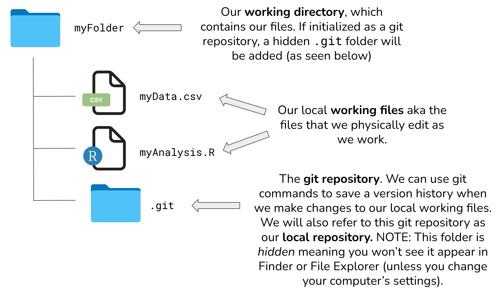{fig-alt="Diagram of a local Git repository with a CSV, R script, and '.git' folder in the project directory" width="70%" .lightbox fig-align="center"}

#### How Do I Tell Git to Preserve Versions of My Local Working Files?

Git was built as a command-line tool, meaning we can use Git commands in the command line (e.g. Terminal, Git Bash, etc.) to take "snapshots" of our local working files. Alternatively, Positron provides buttons that easily execute these Git commands.

Generally, that workflow looks something like this:

- Make changes to a file(s) (e.g. `myAnalysis.R`) in your working directory.
- Stage the file(s) using `git add myAnalysis.R` (or `git add .` to stage multiple changed files at once). This lets Git know that you'd like to include the file(s) in your next commit.
- Commit the file(s) using `git commit -m "a message describing my changes"`. This records those changes (along with a descriptive message) as a "snapshot" or version in the local repository (i.e. the `.git/` folder).

#### How Do I Send Work From My Local Computer to GitHub?

The last step is synchronizing the changes made to our local repository with a remote repository (this remote repository is often stored on GitHub). The `git push` command is used to send local commits up to a remote repository. The `git pull` command is used to fetch changes from a remote repository and merge them into the local repository -- **pull**ing will become a regular part of your workflow when collaborating with others, or even when working alone but on different machines (e.g. a laptop at home and a desktop at the office).

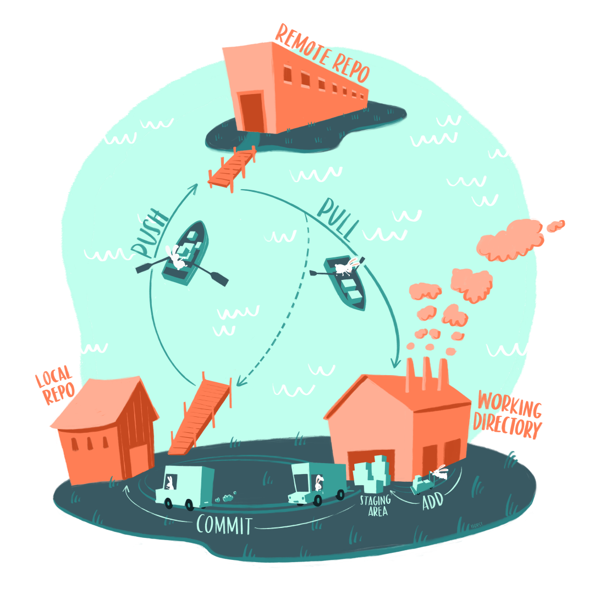{width="70%" .lightbox fig-align="center" fig-alt="A basic Git workflow represented as two islands, one with 'local repo' and 'working directory', and another with 'remote repo.' Bunnies move file boxes from the working directory to the staging area, then with Commit move them to the local repo. Bunnies in rowboats move changes from the local repo to the remote repo (labeled 'PUSH') and from the remote repo to the working directory (labeled PULL')"}
<figcaption>Artwork by Allison Horst</figcaption>

### Let's Look at a GitHub Repository

This screen shows the copy of a repository stored on GitHub, with its list of files, when the files and directories were last modified, and some information on who made the most recent changes.

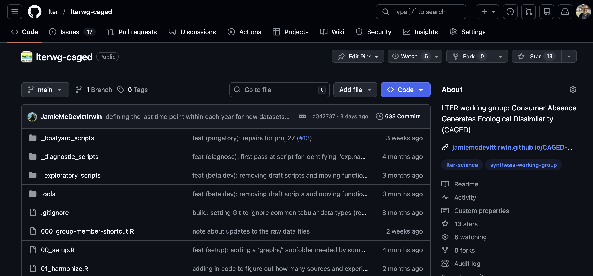{.lightbox fig-alt="Screen capture of a GitHub repository's landing page"}

If we drill into the "commits" for the repository (by clicking the "Commits" button just beneath the colored "Code" dropdown menu), we can see the history of changes made within this repository, including the author, date, and commit message for each commit.

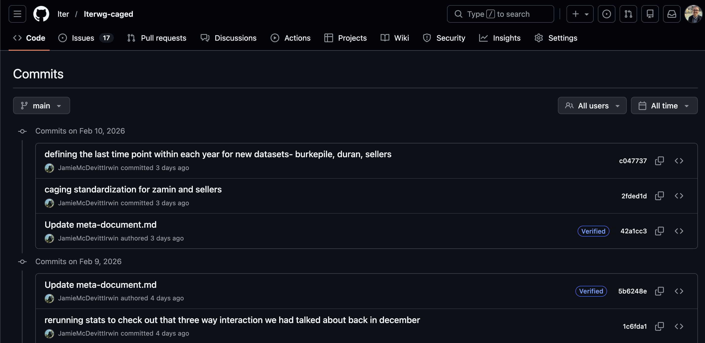{.lightbox fig-alt="Screen capture of a GitHub repository's page showing the history of the commits in the repository"}

And finally, if we drill into a particular commit, we can see exactly what was changed in each file that was included in that commit:

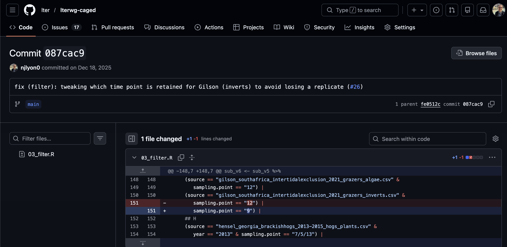{.lightbox fig-alt="Screen capture of a GitHub repository's page showing the 'diff' of files edited in a particular commit"}

Tracking these changes, how they relate to released versions of software and files is exactly what Git and GitHub are good for. And we will show how they can really be effective for tracking versions of scientific code, figures, and manuscripts to accomplish a reproducible workflow.

### Git Vocabulary & Commands

We know the world of Git and GitHub can be daunting. Use these tables as references while you use Git and GitHub, and we encourage you to build upon this list as you become more comfortable with these tools.

:::{.panel-tabset}
#### Essential Git Commands 

This table contains essential terms and commands that complement intro to Git skills. They will get you far on personal and individual projects.

| Term | Git Command(s) | Definition |
|:---:|:-----|:-------------------------|
| Add/Stage | `git add [file]` | Staging marks a modified file in its current version to go into your next commit snapshot. You can also stage all modified files at the same time using `git add .` |
| Commit | `git commit` | Records changes to the repository |
| Commit Message | `git commit -m "my commit message"` | Records changes to the repository and include a descriptive message (you should always include a commit message!) |
| Fetch | `git fetch` | Retrieves changes from a remote repository but does not merge them into your local working file(s). |
| Pull | `git pull` | Retrieves changes from a remote repository _and_ merges them into your local working file(s) |
| Push | `git push` | Sends local commits to a remote repository |
| Status | `git status` | Shows the current status of the repository, including (un)staged files and branch information |

#### Advanced Git Commands

This table includes more advanced Git terms and commands that are commonly used in both individual and collaborative projects.

 Term | Git Command(s) | Definition |
|:---:|:-----|:-------------------------|
| Branch | `git branch` | Lists existing branches or creates a new branch |
| Checkout | `git checkout [branch]` | Switches to a different branch or restores files from a specific commit |
| Clone | `git clone [repository]` | Creates a local copy of a remote repository |
| Diff | `git diff` | Shows differences between files, commits, or branches |
| Log | `git log` | Displays the commit history of the repository |
| Merge | `git merge [branch]` | Integrates changes from one branch into another branch |
| Rebase | `git rebase` | Integrates changes from one branch onto another by modifying commit history |
| Remote | `git remote` | Manages remote repositories linked to the local repository |
| Repository | `git init` | A directory where Git tracks and manages files and their versions |
| Stash | `git stash` | Temporarily saves changes that are not ready to be committed |
| Tag | `git tag` | Assigns a label or tag to a specific commit |

Git has a rich set of commands and features, and there are many more terms beyond either table. Learn more by visiting the [Git documentation](https://git-scm.com/docs).

#### Other Terms

This table includes terms for which there **are not specific Git commands.**

 Term | Definition |
|:---:|:-------------------------|
| Sync | Fetches, merges, and pushes (in that order) commits to/from a local repository |
| Fork  | Creates a personal copy of a repository under your GitHub account for independent development |
| Merge Conflict | Occurs when Git cannot automatically merge changes from different branches, requiring manual resolution |
| Pull Request (PR) | A request to merge changes from a branch into another branch, typically in a collaborative project |

:::

## Exercise 1: Create a Remote Repository on GitHub

::: callout-tip
## Setup

1.  Login to [GitHub](https://github.com/)
2.  Click the **New repository** button
3.  Name it `{firstname}_test`
4.  Add a short description
5.  Check the box to add a `README.md` file
6.  Add a `.gitignore` file using the `R` template
7.  Set the `LICENSE` to Apache 2.0
:::

If you were successful, it should look something like this:

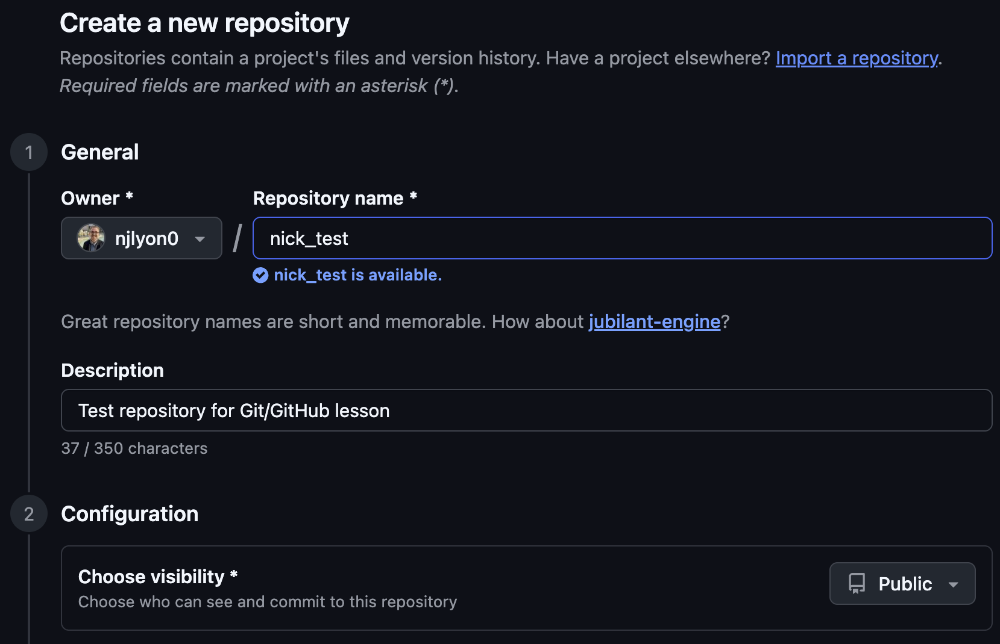{fig-alt="Screen capture of the top half of the page on GitHub that allows a user to create a new repository" width="70%" fig-align="center" .lightbox}
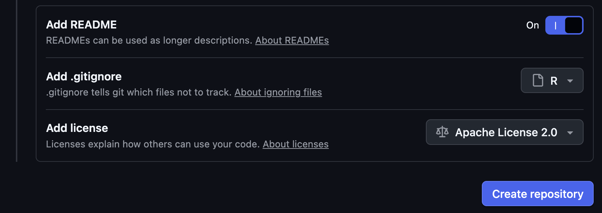{fig-alt="Screen capture of the bottom half of the page on GitHub that allows a user to create a new repository"  width="70%" fig-align="center" .lightbox }

You've now created your first repository! It has a couple of files that GitHub created for you: `README.md`, `LICENSE`, and `.gitignore`. 

:::{.callout-note}
## Purpose & Value of the README

You should always add a `README.md` to the root directory of your repository -- it is a markdown file that is rendered as HTML and displayed on the landing page of your repository. This is a common place to include any pertinent information about what your repository contains, how to use it, etc.
:::

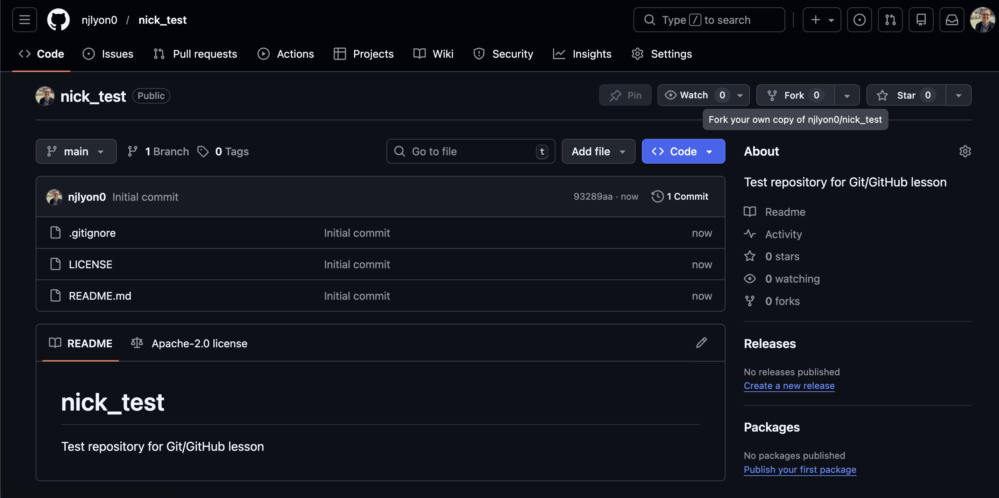{fig-alt="Screen capture of the main landing page for a brand new GitHub repository"  width="100%" .lightbox fig-align="center"}

### Edit a File in Your Repository

For simple changes to text files, such as the `README.md`, you can make edits directly in the GitHub web interface.

::: callout-exercise
## Modify and commit a change on GitHub

Navigate to the `README.md` file in the file listing, and edit it by clicking on the **pencil icon** (top right of file). This is a regular Markdown file, so you can add markdown text. Add a new level-2 header called "Purpose" and add some bullet points describing the purpose of the repo. When done, add a commit message, and hit the **Commit changes** button.
:::

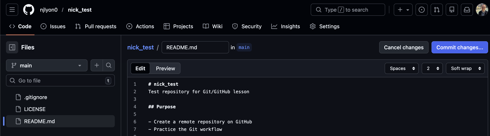{fig-alt="Screen capture of the page in GitHub that appears when you edit a file in a repository directly through GitHub's web interface" width="100%" .lightbox fig-align="center"}

Congratulations, you've now authored your first versioned commit! If you navigate back to the GitHub page for the repository, you'll see your commit listed there, as well as the rendered `README.md` file.

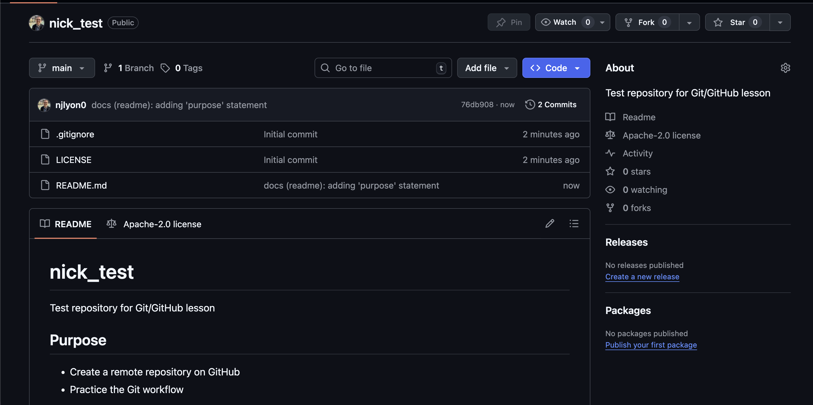{fig-alt="Screen capture of the landing page of a GitHub repository after the README has been edited to include non-template content" width="100%" .lightbox fig-align="center"}

### The GitHub Repository Landing Page

The GitHub repository landing page provides us with lots of useful information. To start, we see: 

- all of the files in the remote repository
- when each file was last edited
- the commit message that was included with each file's most recent commit (which is why it's important to write good, descriptive commit messages!)

Additionally, the header above the file listing shows the most recent commit, along with its commit message, and a unique ID (assigned by Git) called a [SHA](https://docs.github.com/en/pull-requests/committing-changes-to-your-project/creating-and-editing-commits/about-commits#about-commits). The SHA (aka hash) identifies the specific changes made, when they were made, and by who. If you click on the SHA, it will display the set of changes made in that particular commit.

::: {.callout-tip}
## What should I write in my commit message?

Writing effective Git commit messages is essential for creating a meaningful and helpful version history in your repository. It is crucial to avoid skipping commit messages or resorting to generic phrases like "Updates." When it comes to following best practices, there are several guidelines to enhance the readability and maintainability of the codebase.

Here are some guidelines for writing effective Git commit messages:

1. **Be descriptive and concise**: Provide a clear and concise summary of the changes made in the commit. Aim to convey the purpose and impact of the commit in a few words.
2. **Use imperative tense**: Write commit messages in the imperative tense, as if giving a command. For example, use "Add feature" instead of "Added feature" or "Adding feature." This convention aligns with other Git commands and makes the messages more actionable.
3. **Separate subject and body**: Start with a subject line, followed by a blank line, and then provide a more detailed explanation in the body if necessary. The subject line should be a short, one-line summary, while the body can provide additional context, motivation, or details about the changes.
4. **Limit the subject line length**: Keep the subject line within 50 characters or less. This ensures that the commit messages are easily scan-able and fit well in tools like Git logs.
5. **Capitalize and punctuate properly**: Begin the subject line with a capital letter and use proper punctuation. This adds clarity and consistency to the commit messages.
6. **Focus on the "what" and "why"**: Explain what changes were made and why they were made. Understanding the motivation behind a commit helps future researchers and collaborators (including you!) comprehend its purpose.
7. **Use present tense for subject, past tense for body**: Write the subject line in present tense as it represents the current state of the codebase. Use past tense in the body to describe what has been done.
8. **Reference relevant issues**: If the commit is related to a specific issue or task, include a reference to it. For example, you can mention the issue number or use keywords like "Fixes," "Closes," or "Resolves" followed by the issue number.
:::

## Exercise 2: Clone Your Repository Locally

Currently, our repository just exists on GitHub as a remote repository. It's easy enough to make changes to things like our `README.md` file (as demonstrated above) from the web browser, but that becomes a lot harder (and discouraged) for scripts and other code files. In this exercise, we'll bring a copy of this remote repository down to our local computer (aka **clone** this repository) so that we can work comfortably in our local computer.

::: {.callout-important title="An important distinction"}
We refer to the **remote copy** of the repository that is on GitHub as the **origin repository** (the one that we cloned from), and the copy on our local computer as the **local repository**.
:::

To clone our remote repository, we'll use an IDE (<u>I</u>ntegrated <u>D</u>evelopment <u>E</u>nvironment). This is a fancy term for any piece of software that lets you write software. You may already be familiar with some IDEs like [RStudio](https://posit.co/download/rstudio-desktop/), [Positron](https://positron.posit.co/), or [Visual Studio Code](https://code.visualstudio.com/). We offer courses that focus either in Positron or RStudio so you may be using either in your training. In the steps below, **follow the instructions for the IDE suggested by your instructors.**

### Initial Clone

:::{.panel-tabset}
###  Positron 

Positron makes working with Git and version-controlled files easy! To do so, you'll need to **tell Positron the folder in which you want it to clone your origin repository**.

1. Start by copying the link to your GitHub repository from the address bar of your web browser
    - Should be something like `https://github.com/github-username/repository-name`
2. Click the folder icon in the top right corner of Positron
3. Select **New Folder from Git...**
4. In the **Git repository URL** field, paste in the link you copied in step 1
5. Choose which folder you want to clone this repository to
    - We recommend _not_ cloning into a local sync of a cloud storage service (e.g., OneDrive, Dropbox) as that service's form of version control and Git's may cause problems for you
6. Click **OK**

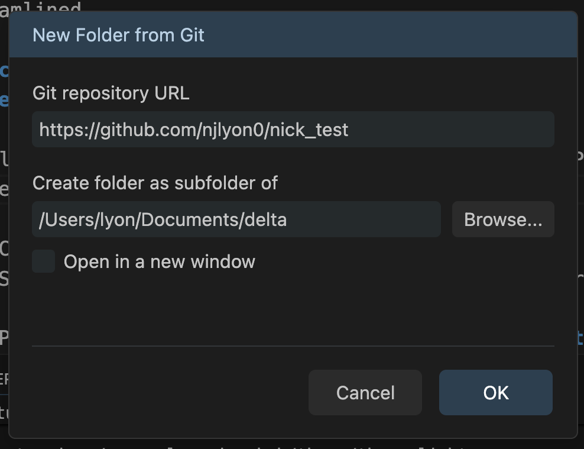{fig-alt="Screen capture of Positron's dialogue menu for cloning a new repository from GitHub" width="50%" fig-align="center" .lightbox}

Once you click **OK**, your Positron window will refresh and the "Explorer" tab (in the left sidebar) will show that all files from the remote repository have been copied locally. Note that the folder icon in the top right corner will now have the name of your repository from GitHub.

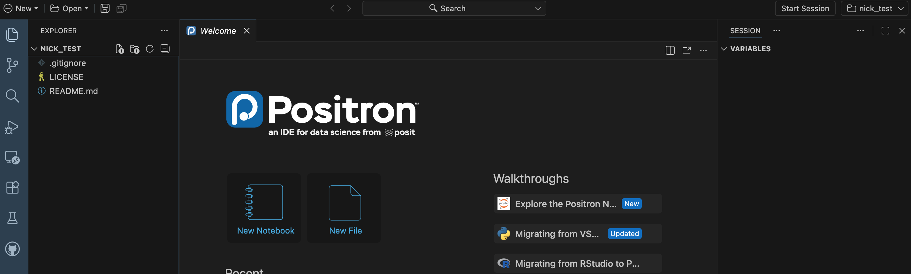{.lightbox fig-alight="center" fig-alt="Screen capture of Positron after successfully cloning a new repository from GitHub"}

If you click the "Source Control" tab (its symbol looks like this: ) you will see that there are no changes because we haven't done anything to the local copy yet! However, both the commits (the initial commit and the test edit made directly in GitHub) are shown in the bottom left corner in reverse chronological order (i.e., most recent at the top).

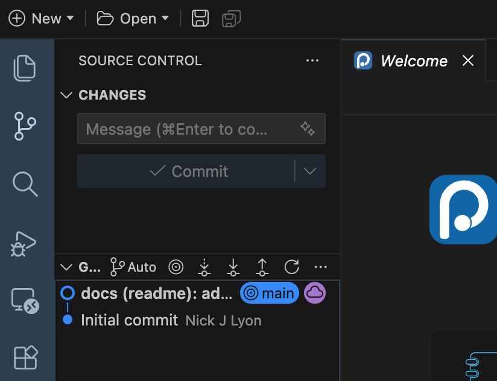{fig-alt="Screen capture of Positron's 'source control' pane after cloning a new repository from GitHub before editing it" width="50%" fig-align="center" .lightbox}

We can actually interact with particular commits to get more detailed information on what was changed directly through Positron! Click the top commit to expand it and see the files that were changed as part of that commit. Now click the README file (the only one edited as part of that commit). A file will now open in the main window of Positron showing the README file with new lines highlighted in green and deleted lines highlighted in red.

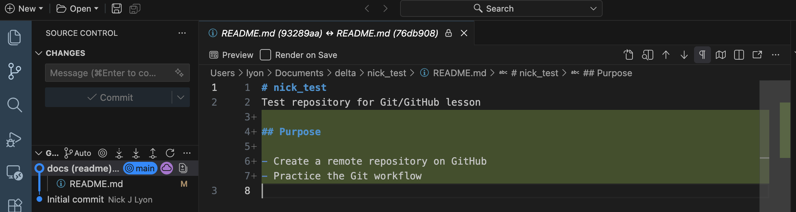{.lightbox fig-alight="center" fig-alt="Screen capture of Positron's 'source control' pane with the 'diff' of the README from a particular commit opened"}

###  RStudio

RStudio makes working with Git and version-controlled files easy! To do so, you'll need to **create a new R Project**.

Start by clicking the **Code** button on your GitHub repository and copying the link from under the **HTTPS** field.

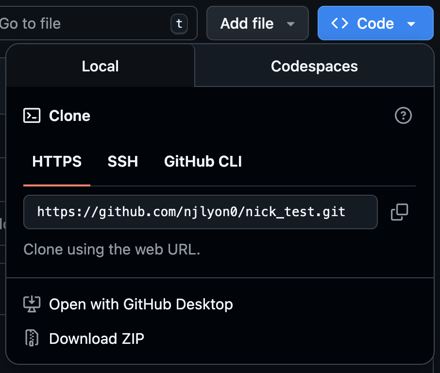{fig-alt="Screen capture of the menu that appears in a GitHub repository when you click the 'Code' button" width="50%" fig-align="center" .lightbox}

**Click the project icon** (looks like the letter "R" in a glass box) in the top right corner of RStudio. Note that if you use RStudio projects already, that button will have the name of the most recent project but if you don't use them it will instead say "Project: (None)". In the resulting dropdown, click **New Project...**

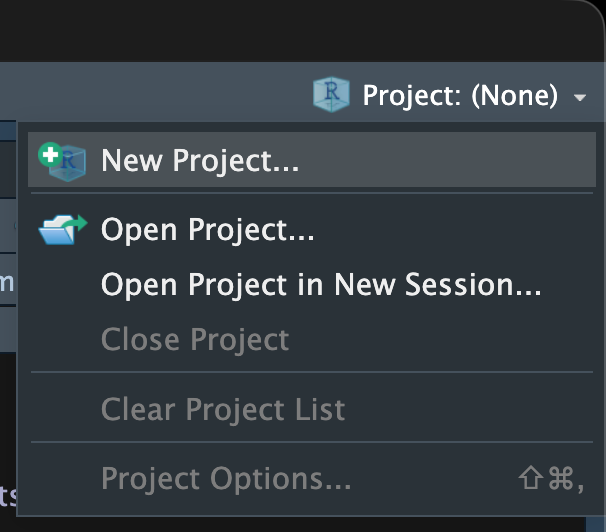{fig-alt="Screen capture of the project dropdown menu in RStudio" width="40%" fig-align="center" .lightbox}

You will now be guided through a set of new project options. Click **Version Control**, then click **Git**. The next dialog is the critical one for getting your local clone set up.

In this dialog, do the following:

1. Paste the link you copied from your remote repository into the **Repository URL** field
2. Enter the name you want for the folder containing your local repository
    - Feel free to just re-use the name of the repository
3. Finally, choose which folder you want to clone this repository to
    - We recommend not cloning into a local sync of a cloud storage service (e.g., OneDrive, Dropbox) as that service’s form of version control and Git’s may cause problems for you

Once that's all done, click **Create Project**.

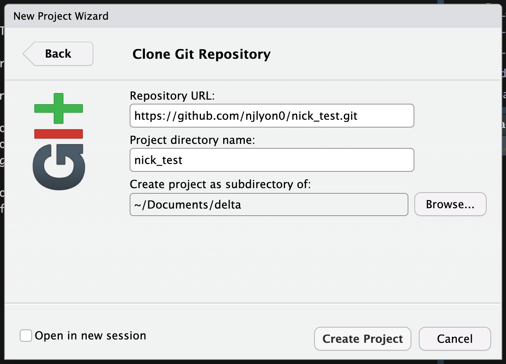{.lightbox fig-alt="Screen capture of the final dialog window in RStudio when cloning a new repository" width="60%" fig-align="center"}

After a moment, your RStudio will refresh and you'll see the name you gave to your local repository's folder in the top right corner next to the project icon.

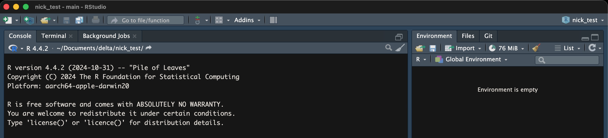{.lightbox fig-alt="Screen capture of the RStudio when in a project that is version-controlled" fig-align="center"}

You may also notice that you have a new tab in RStudio labeled Git. **Click that tab.** You'll see that you have your .Rproj file listed with two **<span style="color:gold">yellow</span>** question marks. RStudio uses this file to define an R Project but because it isn't in your remote repository, Git is flagging it for your attention as a file that is in the tracked folder but is not itself tracked. _Ignore this for now_ as we'll get to more on it later.

<p align="center">
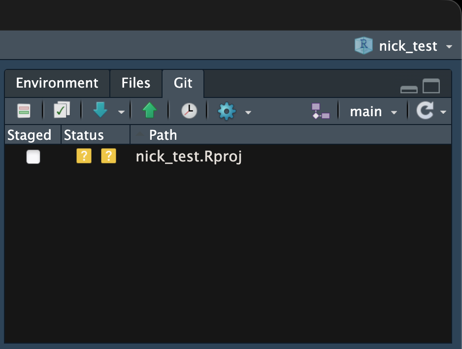
</p>

If you click the "History" button in the Git tab (its symbol is a clock ) you will see all of the commits that have been made in this repository. They are shown in the top half of the window in reverse chronological order (i.e., most recent at the top).

We can actually interact with particular commits to get more detailed information on what was changed directly through RStudio! Click the top commit to expand it and see the files that were changed as part of that commit. The bottom half of the window will now show the README file with new lines highlighted in green and deleted lines highlighted in red.

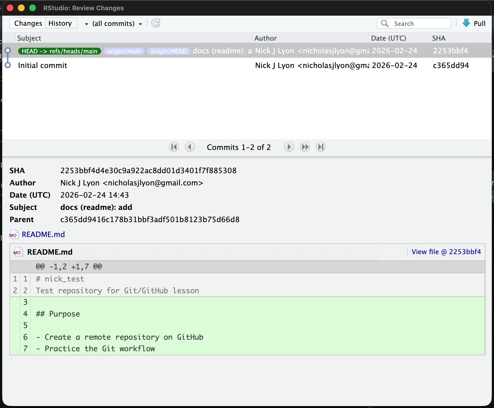{fig-align="center" width="80%" .lightbox fig-alt="Screen capture of RStudio's commit history window with two commits on the repository"}

:::

### Making a Commit

Now that we have seen the changes from the past, let's go ahead and make some new changes in our IDE. Close the history file we had open then open the actual README.md file.

:::{.panel-tabset}
###  Positron
Go to "File Explorer" tab and double click the README file to open it.

###  RStudio
Go to the "Files" pane and click the README to open it.
:::

While adding the purpose statement was nice addition, the top of the README is still looking very template-y, let's customize it a bit. Go ahead and **(1) give the README a more informative title and (2) expand the first line of the description to add some more context.** After you've done this your README should look something like the following.

::: {.callout-hint}
Recall that headers are any line that starts with at least one `#`.
:::

::: {layout-nrow=2}

 Positron
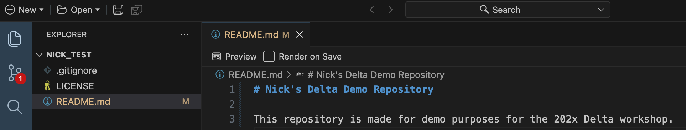{.lightbox fig-alight="center" fig-alt="Screen capture of Positron with the README file opened and Git it is flagging it as having been modified"}

 RStudio
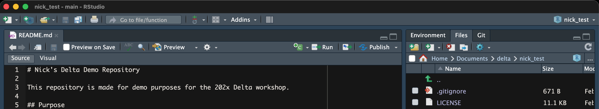{.lightbox fig-alight="center" fig-alt="Screen capture of RSTudio with the README file opened"}

:::

:::{.panel-tabset}
###  Positron

Note that once you edit and save the README, the file's name (both in the Explorer tab list and in the top of Positron) will turn orange and have a capital "M" to the right of the filename. This is Git letting you know that the file has been modified from the most recent version. Additionally, the Source Control tab will get a red circle with a "1," indicating that the state of one file in the version controlled repository has changed.

If you **head over to the Source Control tab**, you'll see that the README now appears under the "Changes" list.

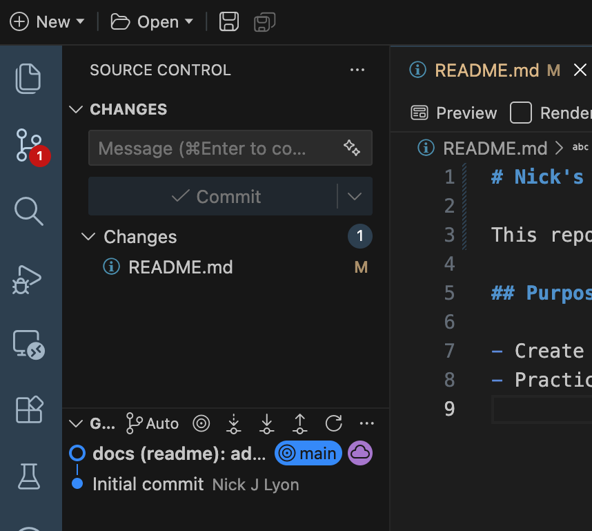{fig-alt="Screen capture of Positron's 'source control' tab with the README file listed under the 'changes' heading" width="50%" fig-align="center" .lightbox}

Once you are there, **hover your mouse over the README and a plus sign button will appear, click it.** Note that the button is not visible unless your mouse is over some part of the "Changes" list. _Clicking that button is analogous to using the Git command, `git add README.md`, in the command line._

After you click the plus sign, the README will move under a new list titled "Staged Changes". You can now add a commit message and then click the "Commit" button when you're ready to do so. _This is analogous to using the Git command, `git commit -m "my commit message"`, in the command line._

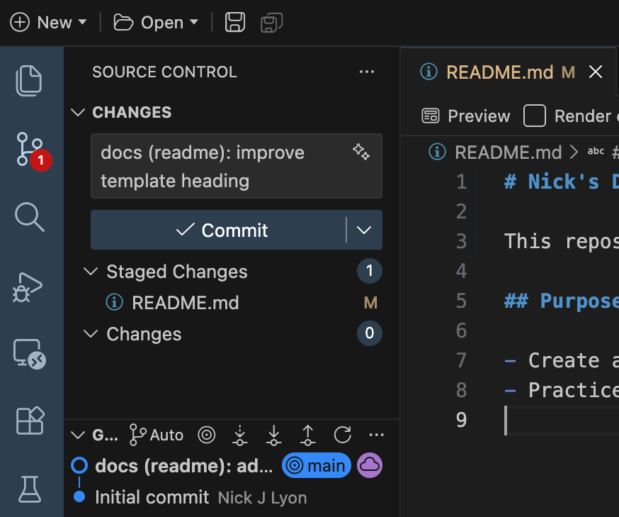{fig-alt="Screen capture of Positron's 'source control' tab with the README file listed under the 'staged changes' heading and an informative commit message in the respective text field" width="50%" fig-align="center" .lightbox}

Once you do that, a few things will happen simultaneously:

- The "Commit" button will automatically change into a "Sync Changes" button.
- Both the "Changes" and "Staged Changes" lists will disappear
- The README file tab will go back to the default color and the "M" next to it will vanish
- The commit history diagram in the bottom left corner will show your new commit (in a different color than the prior commits)

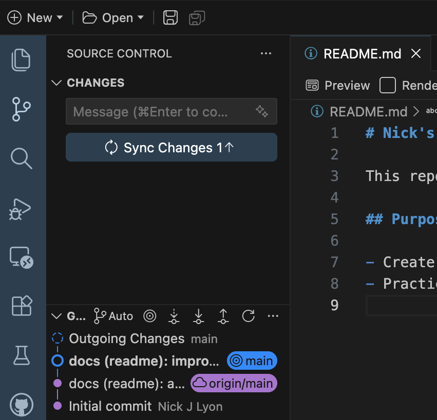{fig-alt="Screen capture of Positron's 'source control' tab with the README file listed under the 'changes' heading" width="50%" fig-align="center" .lightbox}

Go ahead and click the Sync button. It will become a grayed-out Commit button again and your commit history (bottom left) will go back to all being one color as the commit that was previously only on your local repository is synced with the remote repository.

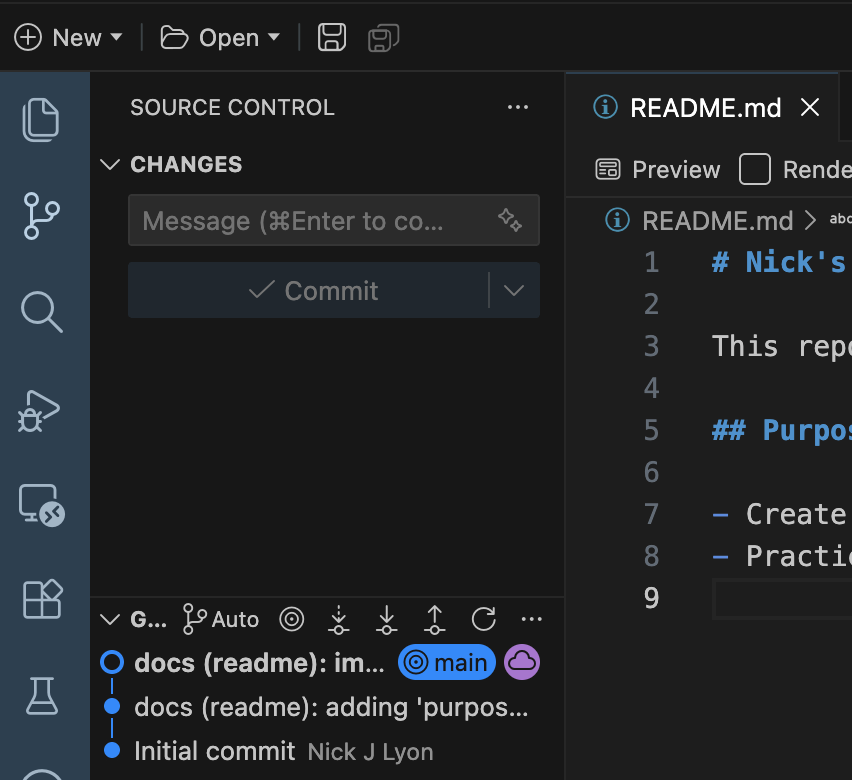{fig-alt="Screen capture of Positron's 'source control' tab where no files are showing as changed or staged" width="50%" fig-align="center" .lightbox}

###  RStudio

If you **head over to the Git pane**, you'll see that the README now appears there with a **<span style="color:blue">blue</span>** "M". That "M" stands for "modified"

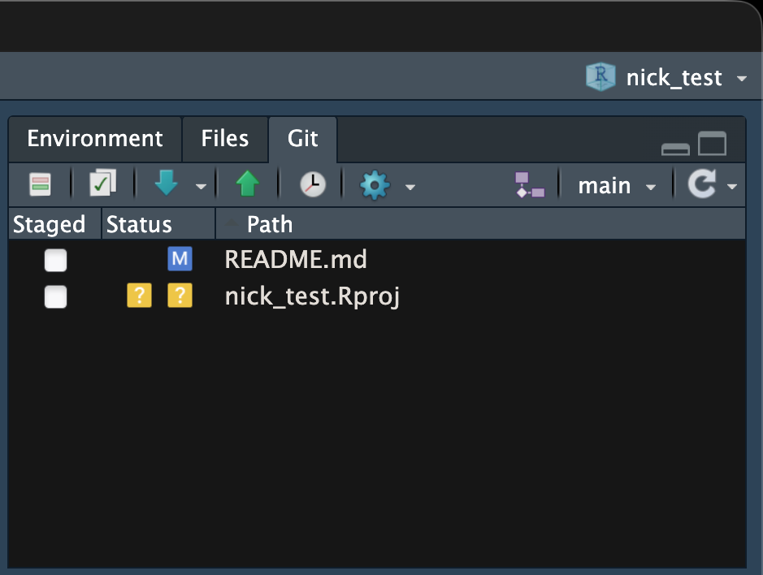{fig-alt="Screen capture of RStudio's 'Git' pane with the README file listed next to blue capital 'M'" width="50%" fig-align="center" .lightbox}

Once you are there, **check the box next to the README** under the "Staged" heading. _Clicking that button is analogous to using the Git command, `git add README.md`, in the command line._

After you check the box, you can **click either of the two left-most buttons in the Git pane.** In the resulting pop-up menu (which looks imilar to the history menu), you can now add a commit message and then click the "Commit" button when you're ready to do so. _This is analogous to using the Git command, `git commit -m "my commit message"`, in the command line._

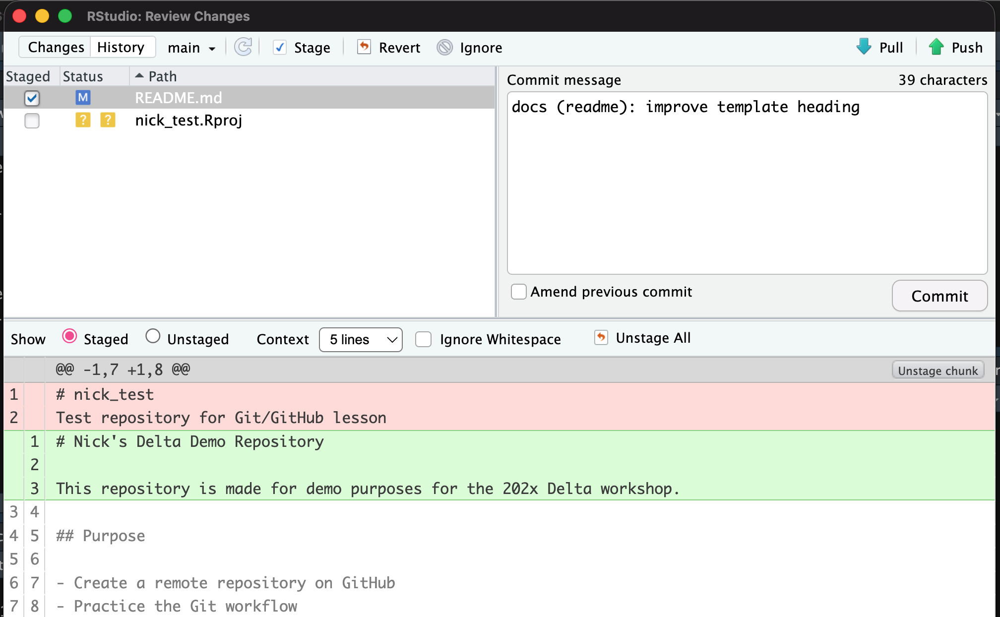{.lightbox width="80%" fig-align="center" fig-alt="Screen capture of RStudio's commit menu with the README file staged and an informative commit message in the respective text field"}

Once you do that, you can **close this menu** and two things should become apparent:

- The README is _no longer_ listed in the Git pane
- There is a new message just beneath the buttons of the Git pane saying something like `Your branch is ahead of 'origin/main' by 1 commit`.

This means that your commit worked!

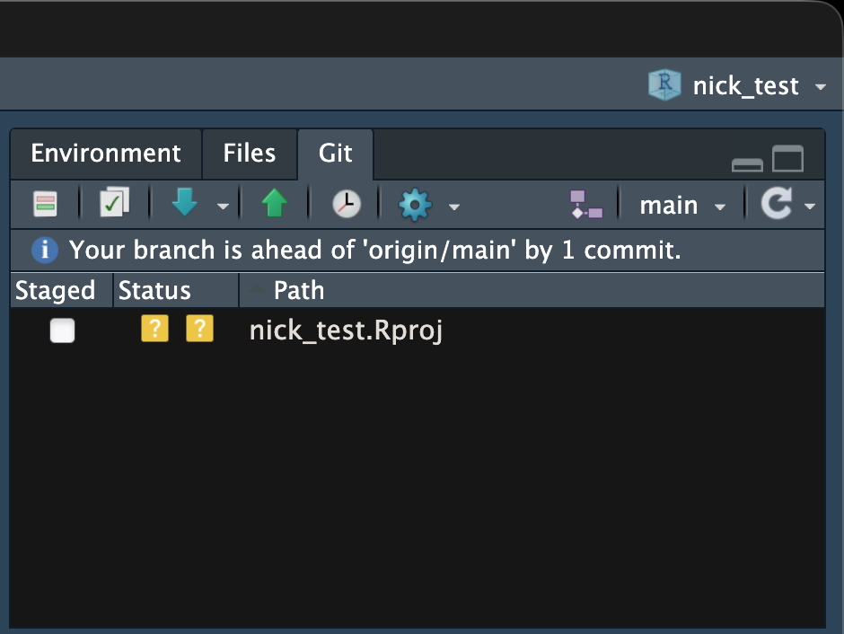{fig-alt="Screen capture of RStudio's 'Git' pane showing that the local repository is one commit ahead of the remote" width="50%" fig-align="center" .lightbox}

Go ahead and **click the Pull button**; it is a downward-facing **<span style="color:blue">blue</span>** arrow (<span style="color:blue"></span>). You should get a message that says `Already up to date`. This is because you're working alone but <u>when collaborating _it is important to pull early and often_ to ensure that you're working on the latest version of all files</u>.

Now that you've pulled, you can **click the Push button**; it is an upward-facing **<span style="color:green">green</span>** arrow (<span style="color:green"></span>). This button will send your local commit 'up' to your remote repository.

:::

If you navigate back to your remote repository on GitHub, you should see the edits to your README and the most recent commit will be the one you just made. Note that sometimes you have to refresh the page or wait a few seconds for those updates to be visible on GitHub.

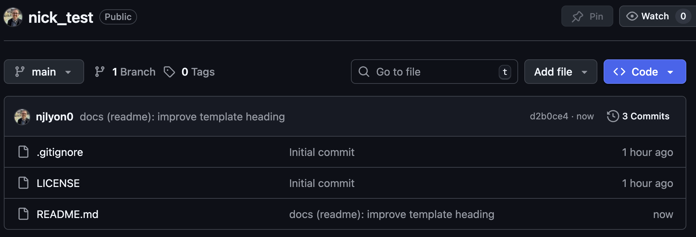{.lightbox fig-alight="center" fig-alt="Screen capture of a GitHub repository's landing page with a new commit"}

::: callout-note
## Challenge

1.  Make a change to the `README.md` file -- this time from Positron -- then commit the `README.md` change
2.  Add a new section to your `README.md` called "Creator" using a level-2 header. Under it include some information about yourself. **Bonus:** Add some contact information and link your email using Markdown syntax.
:::

## Exercise 3: Starting Git on an Existing Folder

There are a number of different workflows for creating version-controlled repositories that are stored on GitHub. We started with Exercise 1 and Exercise 2 using one common approach: create a remote repository on GitHub first, _then_ clone that repository to your local computer. However, you may find yourself in the situation where you **have an _existing_ folder of content that you want to _start_ tracking with Git and host in GitHub.**

There are a few approaches for connecting an existing local folder to Git/GitHub but the folks at Posit have developed some useful tools to streamline this.  The task is slightly different between RStudio and Positron IDEs.

In this last exercise, we will practice this workflow using your `training_{username}` folder.

::: {.panel-tabset}

###  Positron

**Open the Folder in Positron**

Switch to your `training_{username}` folder using the dropdown menu in the top right corner ( Positron: "folder". Click the dropdown next to your current folder name (`{firstname}_test`), and then select `training_{username}` from the list of recent folders you've opened in Positron. If you've never opened the `training_{username}` folder with Positron, click **Open Folder...**.

In this example, there are some existing scripts whose names reflect steps in a typical code workflow.  Your own project will likely look different, but have some files and maybe some folders.

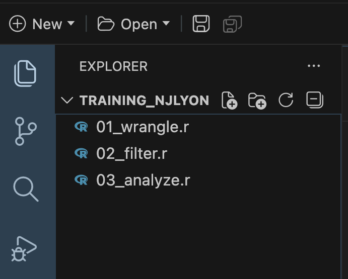{height="2in" fig-align="center" .lightbox fig-alt="Screen capture of Positron's 'explorer' tab with three files"}

**Initialize Git**

Now that we're in the right folder in Positron, **switch to the  Terminal pane** and run the following commands:

1. `git init` - This initializes the current folder/directory to be Git-enabled (by creating a `.git` folder inside).  It will return a message saying something like `Initialized empty Git repository in...` followed by the absolute path to your chosen folder.
2. `git add --all` or `git add .` - this stages all your current files in the folder so Git knows to take a snapshot of them.
3. `git commit -m "initial commit"` - this takes the snapshot of the current state of the files.

**Connect local Git with remote GitHub**

Here, go back to the ** Console pane** - this next step is in R.  We'll use a tool from the `usethis` package to create a remote repository on GitHub (with the same name as the current folder) and push our initial commit out to GitHub.

4. `usethis::use_github()` (note, `install.packages('usethis')` if you don't already have it installed!)
5. That's it!  You will see R go through a series of steps: create a GitHub repository, set remote origin, push main branch, and then optionally opening the URL to take you to your repository on GitHub.

###  RStudio

**Open Project in RStudio**

Switch to your `training_{username}` folder using the dropdown menu in the top right corner ( RStudio: "folder". Click the dropdown next to your current folder name (`{firstname}_test`), and then select `training_{username}` from the list of recent folders you've opened. If you've never opened the `training_{username}` folder with RStudio, click **New Project...**.  Alternately, from the top menu, choose File > Open Project or File > New Project.

In this example, there are some existing scripts whose names reflect steps in a typical code workflow.  Your own project will likely look different, but have some files and maybe some folders.

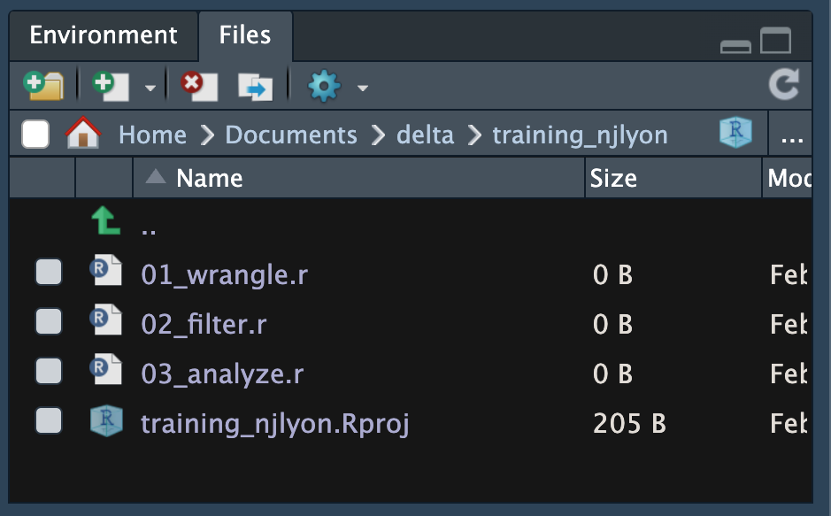{height="2in" fig-align="center" .lightbox fig-alt="Screen capture of RStudio's 'files' pane with three files and the .Rproj file"}

**Initialize Git and Connect to Remote**

Make sure you are in the Console pane - these next step are in R.  We'll use tools from the `usethis` package to initialize the folder as a Git repository, then create a remote repository on GitHub (with the same name as the current folder) and push our initial commit out to GitHub.

1. `usethis::use_git()` (note, `install.packages('usethis')` if you don't already have it installed!).  This will walk through several steps, showing you the progress along the way:
    * set active project to the current project
    * initialize the folder to be a Git repository (`git init` per the commands noted above)
    * creates a `.gitignore` file (see more below) and adds a few file paths to that file.
    * identifies whether there are any uncommitted files and if so asks if you would like to commit them.
2. When asked `Is it ok to commit them?` choose the correct number for a yes/absolutely/affirmative response.  This will:
    * stage the files (`git add --all`)
    * commit them with a message (`git commit -m "initial commit"`)
    * ask if you'd like to restart.
3. When asked `Restart now?` you can choose to restart (to see the Git pane) or not (it won't break anything, you just won't see the Git pane til you restart later)
4. `usethis::use_github()` 
5. That's it!  You will see R go through a series of steps: create a GitHub repository, set remote origin, push main branch, and then optionally opening the URL to take you to your repository on GitHub.

:::


### Tell Git What to Ignore

An absolutely critical component of version control with Git is what Git _doesn't_ track, not just what it _does_ track. **Git repositories each use a file called ".gitignore" to 'decide' what not to track.** Most often, this is used to NOT track:

* large files
* files with sensitive information (e.g., passwords, private data).

:::callout-tip
Any file or folder named in the `.gitignore` won't show up in the version control window of any IDE. This means that you don't need to carefully avoid accidentally staging/committing a sensitive/large file, you can just have that file automatically be ignored by Git. Also, if you ever change your mind and do want to start tracking a file you had previously ignored, just delete the name of that file from the .gitignore and the previously ignored file will become available for staging/committing!
:::

In our earlier exercises, we've started repositories in GitHub with the template ".gitignore" file for R users but there are some slight differences when adding Git tracking to an existing folder.

:::{.panel-tabset}
###  Positron
Positron does not add a ".gitignore" when you create a Git repository in that folder. So we'll need to create one manually.

In the Terminal, follow the instructions below based on your computer's operating system.

- For  Mac /  Linux users: run `touch .gitignore`
- For  Windows users: run `copy NUL .gitignore`
    - If `copy NUL` does not work, try `touch` instead

###  RStudio

RStudio does create a ".gitignore" when you create a Git repository in a project but it is _very_ limited relative to what we'd get from the GitHub template for R. So we'll need to flesh it out.

:::

Once you have a ".gitignore" file:

1. Open the file in your IDE as you would any other file
2. Copy the code in the following code chunk (expand it) and paste into your .gitignore file
    - Overwriting _all_ current contents if there are any
3. Save the file!
    
:::{.callout-tip collapse=true icon=false}
###  Expand for .gitignore template

Copy and paste into your `.gitignore`:
```r
# History files
.Rhistory
.Rapp.history

# Session Data files
.RData
.RDataTmp

# User-specific files
.Ruserdata

# Example code in package build process
*-Ex.R

# Output files from R CMD build
/*.tar.gz

# Output files from R CMD check
/*.Rcheck/

# RStudio files
.Rproj.user/

# produced vignettes
vignettes/*.html
vignettes/*.pdf

# OAuth2 token, see https://github.com/hadley/httr/releases/tag/v0.3
.httr-oauth

# knitr and R markdown default cache directories
*_cache/
/cache/

# Temporary files created by R markdown
*.utf8.md
*.knit.md

# R Environment Variables
.Renviron

# pkgdown site
docs/

# translation temp files
po/*~

# RStudio Connect folder
rsconnect/
```
:::
<!--end gitignore template-->

:::{.callout-note}
#### .gitignore Templates

The .gitignore templates curated by GitHub are generally pretty good so copy/pasting that content will usually set you up for success. Note that as you work more with Git/GitHub, you may develop your own template for a .gitignore that ignores files or folders you consistently use across projects. In that case, feel free to copy that .gitignore's content instead of the generic GitHub template for your coding language.
:::

### Double Check Git's Status

Because we're using the Terminal inside of Positron, we have some helpful visuals to know that things have been going smoothly. However, if you were following these instructions outside of an IDE, you wouldn't have those handy <u>g</u>raphical <u>u</u>ser <u>i</u>nterface (GUI) elements.

In that case you would want to **run `git status` to make sure that the setup tasks you've taken so far are working as desired.** If everything is going smoothly, you should get a message like the following:

```
On branch main

No commits yet

Untracked files:
  (use "git add <file>..." to include in what will be committed)
        .gitignore
        01_wrangle.r
        02_filter.r
        03_analyze.r

nothing added to commit but untracked files present (use "git add" to track)
```

### Stage/Commit Your Files

Now that we're confident Git is set up correctly, we want to start Git tracking on the files that are in our folder. In this case, because we want to track all the files, we can **run `git add .`** to stage all the files. If we only wanted to stage certain files, we could instead run `git add 01_harmonize.r` to stage one file at a time.

Without an IDE's <u>G</u>raphical <u>U</u>ser <u>I</u>nterface (GUI), we could again run `git status` if we want to check whether staging worked as desired.

:::{layout-ncol=2}

 Positron
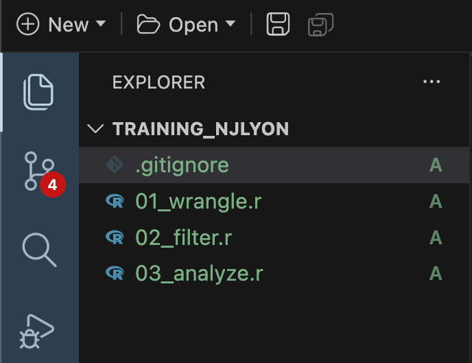{height="2in" fig-align="center" .lightbox fig-alt="Screen capture of Positron's 'explorer' tab where all untracked files are staged"}

 RStudio
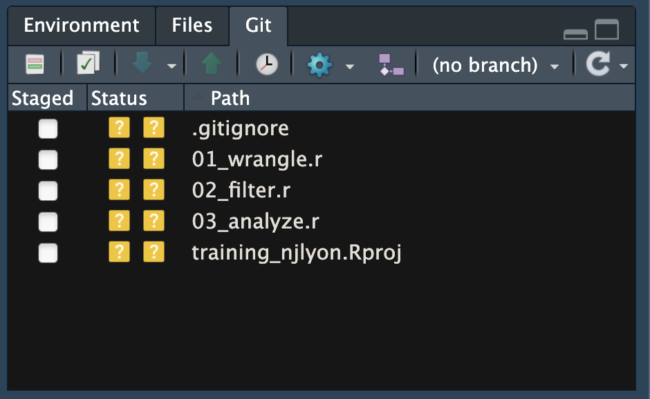{height="2in" fig-align="center" .lightbox fig-alt="Screen capture of RStudio's 'git' pane with three scripts, the .gitignore, and a .Rproj file registering as untracked by Git"}

:::

Once we've staged the files that we want to be included in this first commit, we can **commit all staged files by running `git commit -m "initial commit"` in the Terminal.** Note that it's good practice to replace "initial commit" with something that is more informative and specific.

Without an IDE, you can run `git log` in the Terminal to see a history of your past commits. Here's the log for this repository so far:

```
commit 49245b6433ba49fedb46d09e737e7d239837e11c (HEAD -> main)
Author: njlyon0 <{redacted}@gmail.com>
Date:   Fri Feb 13 15:52:44 2026 -0500

    feat: first commit of core scripts
```

::: {.callout-caution icon=false}
## Challenge: Add a `README.md` file to `training_{username}`

GitHub provides a button on your repo's landing page for quickly adding a `README.md` file. Click the **Add a README** button and use markdown syntax to create a `README.md`. Commit the changes to your repository.

Go to your local repository and pull the changes you made.
:::

## Going Further

There's a lot we haven't covered in this tutorial. There are some great and much longer tutorials that cover advanced topics, such as:

- [Pro Git Book](https://git-scm.com/book/en/v2)
- [Happy Git and GitHub for the useR](https://happygitwithr.com/)
- [GitHub Documentation](https://docs.github.com/en/get-started/quickstart/set-up-git)
- [Learn Git Branching](https://learngitbranching.js.org/) is an interactive tool to learn Git on the command line
- [Software Carpentry Version Control with Git](https://swcarpentry.github.io/git-novice/)
- Bitbucket's tutorials on [Git Workflows](https://www.atlassian.com/git/tutorials/comparing-workflows)


<iframe width="560" height="380"src="https://docs.google.com/presentation/d/1V5WJYPTcsrKwkiKr5Z4Hzc6m3D2al4cq0j-rBawPkoU/preview" allowfullscreen></iframe>

