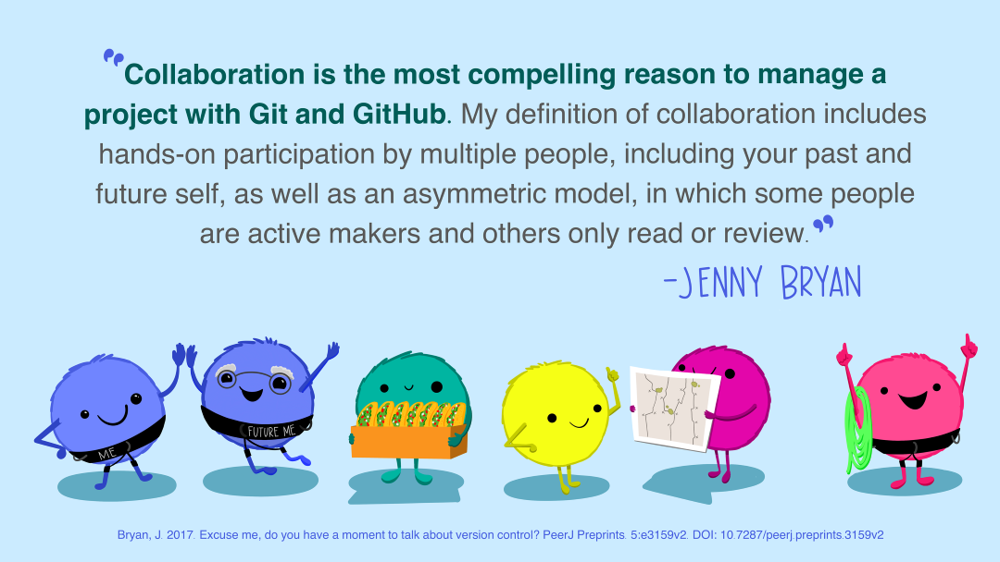
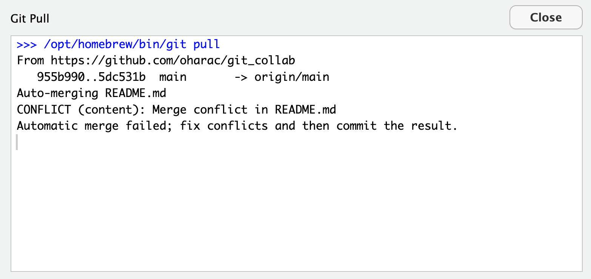
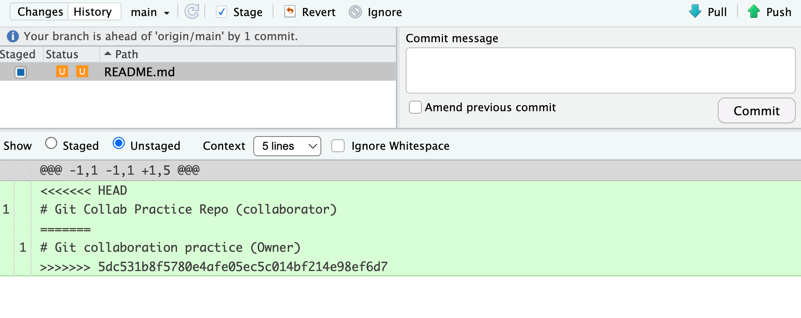

<!---
Old (as of June 2026) GoogleSlides deck on this topic here: https://docs.google.com/presentation/d/1bIS1urTZ-IMOXGafqSe8gYfJ_PWqKTRoblxvubFzVY8
--->

:::{.callout-tip icon="false"}
###  Learning Objectives

After completing this session, you will be able to:

- Describe common causes of conflicts that arise when collaborating on repositories 
- Resolve conflicts using Git conflict resolution techniques
- Apply workflows and best practices that minimize conflicts on collaborative repositories
:::

{width="100%" fig-align="center" .lightbox fig-alt="Artwork by @allison_horst with a quote from Jenny Bryan that reads: 'Collaboration is the most compelling reason to manage a project with Git and GitHub.  My definition of collaboration includes hands-on participation by multiple people, including your past and future self, as well as an asymmetric model, in which some people are active makers and others only read or review.'"}

Git is a powerful tool for both individual and collaborative work. The most common way to collaborate is through a **shared repository on [GitHub](https://github.com)**, which acts as a central hub where teammates can exchange and merge changes. In this lesson, one person (the **Owner**) hosts the repository on GitHub and grants a colleague (the **Collaborator**) permission to push changes directly.

{width="70%" fig-align="center" .lightbox fig-alt="Diagram showing the relationship between the Owner, Collaborator, and GitHub repository. The Owner has a local repository and a remote repository on GitHub. The Collaborator has a local repository that is connected to the remote repository on GitHub. Both the Owner and Collaborator can pull changes from GitHub to their local repositories and push changes from their local repositories to GitHub."}

Before diving into the exercise, keep these tips in mind - we'll return to them throughout:

* Start every work session with a Pull, and Pull occasionally throughout (to ensure you are up to date with your collaborator's changes!)
* Save  Stage (Add)  Commit  Sync (Pull  Push) your work throughout the session, in small logical chunks (so your changes are available to your collaborator!)

And the single most effective conflict-prevention strategy: **communicate with your collaborators** before and after making changes. Knowing who is editing which files, and when, eliminates most problems before they start.

:::callout-note
## Pull  Push versus Sync

The RStudio IDE uses the terms *Pull* and *Push* for Git operations, while the Positron IDE uses *Sync* to encompass both pulling and pushing changes. Because the underlying Git operation is *pull*  *push*, we will use this terminology instead of *sync.*
:::

## Collaborating Without Conflicts

### Demonstration

We start with the ideal scenario: two collaborators taking turns, working on the same repo without ever editing the same lines simultaneously.  

Here, the instructors will demonstrate.  In the following exercise, the participants will pair up and try it themselves.

1. [**Owner**]{style="color: orange;"} adds [**Collaborator**]{style="color: purple;"} on GitHub
    - [**Owner**]{style="color: orange;"} creates a new repository on GitHub, called `git_collab_<username>` (or similar), and includes a README.  
    - Then, [**Owner**]{style="color: orange;"} navigates to the repository  **Settings**  **Collaborators**  **Add people**. Enter the [**Collaborator's**]{style="color: purple;"} username and send the invitation. 
    - The [**Collaborator**]{style="color: purple;"} accepts via email or GitHub notifications, gaining push access.
2. [**Collaborator**]{style="color: purple;"} clones the repository
    - The [**Collaborator**]{style="color: purple;"} navigates to the [**Owner's**]{style="color: orange;"} GitHub repository, copies the clone URL, and creates a new RStudio project or Positron folder from version control using that URL.
    - Note: the cloned repo **will not** appear under the [**Collaborator's**]{style="color: purple;"} own GitHub profile page.
3. [**Collaborator**]{style="color: purple;"} creates new file, commit-pull-push
    - With the repo cloned, the [**Collaborator**]{style="color: purple;"} creates a new Quarto document, edits the title (e.g., "Git Collaboration Tips") and author(s).
    Delete any placeholder text in the body of the document, leaving just the YAML header and a blank body.  Then paste in the content in the details box below.  
    - Save the Quarto doc as `git_collaboration_tips.qmd` in the repo directory.

<details>
<summary>Content for new file</summary>
Paste the following template text into the Quarto document body:
```markdown

## Git Collaboration Tips

### Tips: <owner's name here>

<Owner adds their tips here!>

### Tips: <collaborator's name here>

<Collaborator adds their tips here!>

## How to Create a Merge Conflict 

### Merge Conflict: Owner Resolves

<Owner and Collaborator edit the same line here to create a conflict! - COLLABORATOR commits-pulls-pushes first>

### Merge Conflict: Collaborator Resolves

<Owner and Collaborator edit the same line here to create a conflict! - OWNER commits-pulls-pushes first>

## Summary: How to Avoid Merge Conflicts

<Owner and Collaborator use best practices to write some concluding tips here!>
```
</details>

4. [**Collaborator**]{style="color: purple;"} follows the standard workflow:
    - **Stage and commit** the new file
    - **Pull** (to fetch any changes made since cloning)
    - **Push** to the shared remote repository

:::callout-tip
## Communicate!
Let the [**Owner**]{style="color: orange;"} know you've pushed your changes so they know it's safe to pull.
:::

5. [**Owner**]{style="color: orange;"} pulls, all repos now in sync
    - The [**Owner**]{style="color: orange;"} opens their local copy in RStudio and **pulls** the [**Collaborator's**]{style="color: purple;"} changes. 
    - All three repositories - remote, [**Owner's**]{style="color: orange;"} local, and [**Collaborator's**]{style="color: purple;"} local - are now in sync.
6. [**Owner**]{style="color: orange;"} and [**Collaborator**]{style="color: purple;"} add tips, then commit-pull-push
    - The [**Owner**]{style="color: orange;"} then edits their own "tips" section ONLY.
    - At the same time as the the [**Owner**]{style="color: orange;"} is adding their tips, the [**Collaborator**]{style="color: purple;"} adds their own tips to their section ONLY.
7. Wrapping Up
    - Both [**Owner**]{style="color: orange;"} and [**Collaborator**]{style="color: purple;"} follow the same **commit  pull  push workflow** - Decide who goes first, though it should not matter here - and **communicate**!
    - Once both have pulled each other's changes, the first person should do one last **pull** to retrieve changes made by the second.
    - Check with each other to ensure the repositories are in sync again.

**You've just successfully collaborated!** 

:::{.callout-warning} 
## Why Commit Before Pulling?

`git pull` includes a merge step. **If you have uncommitted local changes, Git will refuse to merge** - since it doesn't know exactly where *you've* made changes, it doesn't know where it can safely merge in your *collaborator's* changes. Always:

commit  pull  push (RStudio or Terminal) or commit  sync (Positron)
:::

### Exercise: Collaborate Well!

Get into pairs.  Designate one person as [**Owner**]{style="color: orange;"} and one as [**Collaborator**]{style="color: purple;"} - we recommend whoever has the **fewer** repositories should be the [**Owner**]{style="color: orange;"}.  

::::{.callout-note }
## Setup

* [**Owner**]{style="color: orange;"}: Create a new repository `git_collab_<username>` then go to **Settings**  **Collaborators**  **Add people**  add your partner's username
* [**Collaborator**]{style="color: purple;"}: accept the invitation from your email or GitHub notifications

:::

:::{.callout-exercise}

### Instructions{.unnumbered}

* [**Owner**]{style="color: orange;"} adds [**Collaborator**]{style="color: purple;"} to `git_collab_<username>` (see Setup above)
* [**Collaborator**]{style="color: purple;"} clones the [**Owner**]{style="color: orange;"}'s repository
* [**Collaborator**]{style="color: purple;"} creates a new Quarto document `git_collaboration_tips.qmd` with the provided template content above, then saves and commit-pull-push
* [**Owner**]{style="color: orange;"} pulls those changes
* [**Owner**]{style="color: orange;"} and [**Collaborator**]{style="color: purple;"} each their own Git tips under their respective headers
* [**Owner**]{style="color: orange;"} and [**Collaborator**]{style="color: purple;"} decide who will commit-pull-push first, and each performs the Git workflow as agreed
* The first person to commit-pull-push does one final pull to retrieve the second person's changes 

:::

## Merge Conflicts

A **merge conflict** occurs when two collaborators edit the *same line(s) of the same file*. Git cannot automatically decide which version to keep, so it pauses the merge and asks you to resolve the conflict manually.

When a conflict occurs, Git marks the affected section of the file like this:

```r
 <<<<<<< HEAD
 Your version of this line
 =======
 Collaborator's version of this line
 >>>>>>> (commit SHA)
```
<!-- NOTE: added space in front of conflict message lines to prevent rendering issues in Quarto -->

To resolve the conflict: edit the file so it reads how you want, remove all the marker lines (`<<<<<<<`, `=======`, `>>>>>>>`), then stage (add), commit-pull-push.  This might look different depending on your IDE.

:::{.panel-tabset}
###  Positron

{width="70%" fig-align="center" .lightbox fig-alt="Screenshot of Positron IDE showing a merge conflict warning and diff view with conflict markers"}

In Positron, when you pull remote changes that conflict with local changes, you will see a window that looks like this.  Conflicted files appear with a red "!" icon in the Git pane.  The image also shows the "diff" view where you can see the header `<<<<<<<`, footer `>>>>>>>` followed by commit SHA, and dividing line `=======`.  

You can edit the conflicted file(s) directly in this view, or click on [&nbsp;**Resolve in Merge Editor**&nbsp;]{style="color:white; background-color:blue;"} to open the file in the Merge Editor:

{width="70%" fig-align="center" .lightbox fig-alt="Screenshot of Positron IDE Merge Editor showing the same conflict markers as the diff view, but with options to select either version or both"}

After resolution and staging, the icon changes to a green "M" (Modified).

###  RStudio

{width="70%" fig-align="center" .lightbox fig-alt="Screenshot of RStudio window showing the warning message: 'CONFLICT (content): Merge conflict in README.md. Automatic merge failed; fix conflicts and then commit the result.'"}

In RStudio, when you pull remote changes that conflict with local changes, you will see a window that looks like this.  Read it - it basically says there was a merge conflict and it needs to be fixed and then committed before you can do anything else.  Close the window.

{width="70%" fig-align="center" .lightbox fig-alt="Screenshot of RStudio window showing the diff view with conflict markers"}

In RStudio, conflicted files appear with an orange U (Unmerged) in the Git pane. The image also shows the "diff" view where you can see the header `<<<<<<<`, footer `>>>>>>>` followed by commit SHA, and dividing line `=======`.  You can resolve your edits in the text editor.

After resolution and staging, the icon changes to a blue M (Modified).

:::

### Three Ways to Resolve a Conflict!

Depending on whether you want to keep none, part, or all of the changes made by the collaborator and owner, there are three common options for resolving a merge conflict.

:::{.panel-tabset}
### Manually Edit

Open the file (or in Positron, use the Merge Editor), hand-edit the conflict blocks to produce the desired result (keeping some of each version if needed), making sure to remove the conflict marker lines.  Then save your resolved file, stage, commit-pull-push. **This is the most flexible approach.**

### Abort!

Abort - if you made a mistake and want to start fresh:

```bash
git merge --abort
```

This returns the repo to a usable state, as it was just before you tried to pull - but you still haven't integrated your collaborator's changes.  This basically just kicks the can down the line!

### Keep One Version Entirely

From the Terminal, choose whose version to keep (note, need to specify the file!).  Note, you should DEFINITELY communicate with your collaborator before rejecting their changes wholesale.

To keep your collaborator's version: 
```bash
git checkout --theirs <path/to/conflicted_file.qmd>
```

To keep your own version: 
```bash
git checkout --ours <path/to/conflicted_file.qmd>
```

Then stage, commit-pull-push as normal.

:::

## Producing and Resolving Merge Conflicts

### Demonstration

As before, the instructors will first demonstrate this sequence. Then participants will pair off and work through this in the exercise that follows.

1. **Both** pull to sync to the [**Owner's**]{style="color: orange;"} `git_collab_<username>` repository
    - Ensure both [**Owner**]{style="color: orange;"} and [**Collaborator**]{style="color: purple;"} have all the latest changes locally (Git pane shows no pending commits).
2. [**Owner**]{style="color: orange;"} edits the content in the Quarto document under the section titled "Merge Conflict: Owner Resolves" and commits - but **does not pull or push**
3. [**Collaborator**]{style="color: purple;"} edits the same line and commits - but **does not pull or push**
    - **Both people now have local commits that conflict with each other!**
4. [**Collaborator**]{style="color: purple;"} pushes
    - **GitHub now reflects the [Collaborator]{style="color: purple;"}'s version.** The [**Owner**]{style="color: orange;"} is one commit behind.
5. [**Owner**]{style="color: orange;"} tries to push and gets an error
    - GitHub rejects the push because the [**Owner**]{style="color: orange;"}'s repo is out of date. The error message instructs them to pull first.
6. [**Owner**]{style="color: orange;"} pulls but now, gets a **merge conflict** warning
    - Git flags the conflict: the file appears with an orange U in RStudio's Git pane. or a red [**!**]{style="color: red;"} in Positron's Git pane. 
    - The file contains the conflict markers (`<<<<<<<`, `=======`, `>>>>>>>`) showing both versions of the conflicting lines.
7. [**Owner**]{style="color: orange;"} edits the file to resolve the conflict
    - Owner communicates with [**Collaborator**]{style="color: purple;"} if there is any uncertainty about how to resolve the conflict.
    - Find and resolve all `<<<<<<< ... ======= ... >>>>>>>` blocks. Verify the code logic still works correctly after merging.
8. [**Owner**]{style="color: orange;"} stages/adds the resolved file, then applies commit-pull-push workflow
9. [**Collaborator**]{style="color: purple;"} pulls the resolved version

Both repos are back in sync. The commit history now shows the conflict branch and the merge. 😅

### Exercise: Collaborate Poorly!

:::{.callout-exercise}

Work with the same partner as the previous exercise (since you've already both invited one another as collaborators!). Complete two rounds, switching roles between them.

**Round One:**

1.  **Both** pull to sync to the [**Owner's**]{style="color: orange;"} `git_collab_<username>` repository
2. [**Owner**]{style="color: orange;"} edits the content in the section titled "Merge Conflict: Owner Resolves" and commits but **does not pull or push**
3. [**Collaborator**]{style="color: purple;"} edits the same section differently and commits but **does not pull or push**
    - **Both people now have local commits that conflict with each other!**
4. [**Collaborator**]{style="color: purple;"} pushes
    - **GitHub now reflects the [Collaborator]{style="color: purple;"}'s version.** The [**Owner**]{style="color: orange;"} is one commit behind.
5. [**Owner**]{style="color: orange;"} tries to push  gets an error (consider why?)
6. [**Owner**]{style="color: orange;"} pulls  and sees merge conflict
7. [**Owner**]{style="color: orange;"} edits the file to resolve the conflict
    - [**Owner**]{style="color: orange;"} communicates with [**Collaborator**]{style="color: purple;"} to make sure edits are OK!
8. [**Owner**]{style="color: orange;"} stages, then commit-pull-push the resolved file
9. [**Collaborator**]{style="color: purple;"} pulls the resolved version
10. Both view commit history to see the conflict and merge commits.
11. Repeat steps 2-10, in the section titled "Merge Conflict: Collaborator Resolves", and this time, swap the order of who pushes first.

**Congratulations, you've just created and resolved two merge conflicts!** 

:::

### Discussion

What are some steps you could have taken to avoid merge conflicts in the first place? How would you communicate with your collaborator to prevent or resolve conflicts?

## Best Practices to Avoid Merge Conflicts

Some basic rules of thumb can avoid the vast majority of merge conflicts, saving a lot of time and frustration. These are words our teams live by:

:::{.column-margin}
[](https://xkcd.com/1597/){fig-alt="XKCD comic showing three people at a desk.  One points to a computer and says 'This is Git. It tracks collaborative work on projects througha beautiful distributed graphy theory tree model.' The second person says 'Cool. How do we use it?' The third person says 'No idea. Just memorize these shell commands and type them to sync up.  If you get errors, save your work elsewhere, delete the project, and download a fresh copy.'"}
:::

- **Communicate before and after changes.** Tell your collaborator what you're about to work on, and when you've pushed.
- **Divide the work and work in different sections or files.** Avoid editing the same part of the same files simultaneously.
- **Start every session with a pull.** And then pull occasionally while working just to make sure you're up to date with your collaborator's changes.
- **Pull again before you push** (after committing). This ensures you have the latest changes before you try to push (and avoids Git's warning about uncommitted changes).
- **Commit in small, logical chunks.** This makes it easier to review and easier to merge your changes.
- **Make sure everyone understands the workflow** before you start collaborating.

:::{.callout-tip}
### Internalize this Workflow!

Pull  Edit  Save  Add (stage)  Commit  Pull^\*^  Push

^\*^ = Resolve any merge conflicts if necessary!

:::

It may take a bit of practice to get comfortable with navigating merge conflicts, but like any other technical skill, they'll become less intimidating with time. With careful communication and a consistent workflow, conflicts can be largely avoided or resolved when they do occur.
