<!--- 
No (known) GoogleSlides deck for this lesson
--->

:::{.callout-tip icon="false"}
###  Learning Objectives

After completing this session, you will be able to:

- Define branch, fork, reset, and revert in the context of Git/GitHub 
- Contrast branches and forks
- Create a branch on an existing repository
- Use the fork feature on GitHub for an existing repository
- Explain the three different types of reset, when they're useful, and how they differ in severity

:::

::: {.callout-note}
## Acknowledgments

Parts of this page were adapted from the Long Term Ecological Research (LTER) Network's workshop "Collaborative Coding with GitHub". Those materials can be found at [lter.github.io/workshop-github](https://lter.github.io/workshop-github/)
:::

## Overview

At this point, you're likely at least somewhat familiar with the fundamental operations of Git and GitHub; you know how to stage your edits, make (informative) commit messages, and sync (pull/push) those changes between a remote repository and a local clone of that repository. However, in prior modules, a handful of topics have been raised but only touched on in a superficial way. This module is where we will dig into greater detail on some of these "advanced" topics.

We'll discuss branches and forks--what they are, how they differ, and when/how to use them--how they relate to pull requests, and how to un-do problematic commits with varying levels of severity.

## Core Vocabulary

We've covered a number of the fundamental tools for working with Git and GitHub already. However, to this point, we've only lightly touched on "branches" and "forks," two terms that sometimes arise in advanced Git/GitHub collaborations.

:::{.panel-tabset}
### Branches

**A "branch" is essentially a working area in your Git repository that is separate from, but connected to, your main working area.** Branches can be incredibly useful when you have a task to work on but you don't want to risk damaging the version of your code that already works. Note that "branch" can be either a noun or a verb as with many of the Git vocabulary words discussed earlier (e.g., "commit", "push").

**_Typically_, branches are typically created with a specific task/sub-task in mind and deleted once that task is done.** There are some exceptions to this but generally keeping a manageable number of active branches and deleting inactive branches will make it easier for your team to collaborate in the right branch(es).

As an analogy, imagine that you want to put a better engine in your car but you don't want to risk damaging your car as you go about that job. In Git terms, you'd create a copy of your car that you could work on (i.e., a branch) while still running errands or driving to work with the version of your car before you started tinkering (i.e., the main branch). When you feel that you've finished upgrading your car, you can seamlessly combine the two cars, keeping all improvements made in the branch version. You could instead decide that the branch version of your car isn't actually worthwhile and abandon/delete it instead of merging it with the 'actual' version of your car.

Benefits | When to Use | When Not to Use |
|----------|-------------|-----------------|
| - Enables parallel development and experimentation<br>- Facilitates isolation of features or bug fixes<br> - Provides flexibility and control over project workflows | - When working on larger projects with multiple features or bug fixes simultaneously<br> - When you want to maintain a stable main branch while developing new features or resolving issues on separate branches<br> - When collaborating with teammates on different aspects of a project and later integrating their changes | - When working on small projects with a single developer or limited codebase<br> - When the project scope is simple and doesn't require extensive branch management<br> - When there is no need to isolate features or bug fixes |

### Forks

**A "fork" is a duplicate of a GitHub repository that has a different owner than the original.** Any repository that you can view on GitHub, you can fork. This includes (1) any public repository, and (2) private repositories to which you have access.

Forks are most commonly used when you want to use someone else's work to 'jump start' your own, but aren't collaborating with that person and likely don't want to re-integrate your changes into their version of the project. 

Returning to our car analogy, a fork would be when you like a car that you see someone else driving so you make a copy of it and then modify your copy to better suit your lifestyle and aesthetic tastes. You _could_ offer your changes back to the original car owner but probably if they wanted those edits, you'd be a formal collaborator and you'd be working in a branch of their repository rather than your own fork.

| Benefits | When to Use | When Not to Use |
|----------|-------------|-----------------|
| - Enables independent experimentation and development<br>- Provides a way to contribute to a project without direct access<br>- Allows for creating separate, standalone copies of a repository | - When you want to contribute to a project without having direct write access to the original repository<br> - When you want to work on an independent variation or extension of an existing project<br> - When experimenting with changes or modifications to a project while keeping the original repository intact | - When collaborating on a project with direct write access to the original repository<br> - When the project does not allow external contributions or forking<br> - When the project size or complexity doesn't justify the need for independent variations |

:::

The difference between **forks** and **branches** is a source of great confusion for many (even veteran!) Git and GitHub users but hopefully this table helps to clarify!

| FAQ | Branch | Fork | 
|:----------------|:---:|:---:|
| Does making one also create a new repository? | No | **Yes!** |
| Does repository ownership change when you make one? | No | **Yes!** |
| Does <u>Git</u> know the "parent" repository/branch? | **Yes!** | No |
| Does <u>GitHub</u> know the "parent" repository/branch | **Yes!** | **Yes!** |

## Pull Requests

Regardless of whether you branch or fork, when you want to merge your changes into another branch or back to the original repository, it is good practice to use a **"pull request"** to do this! A pull request (a.k.a. "PR") is a GitHub feature that allows collaborators on a project to do a specific review of the content from a branch/fork as a final check before those edits are integrated into the another branch/repository.

| Benefits | When to Use | When Not to Use |
|----------|-------------|-----------------|
| - Facilitates code review and discussion<br>- Allows for collaboration and feedback from team members<br>- Enables better organization and tracking of proposed changes | - When working on a shared repository with a team and wanting to contribute changes in a controlled and collaborative manner<br>- When you want to propose changes to a project managed by others and seek review and approval before merging them into the main codebase | - When working on personal projects or individual coding tasks without the need for collaboration<br>- When immediate changes or fixes are required without review processes<br>- When working on projects with a small team or single developer with direct write access to the repository |

## Branch Workflow

Before diving into the specifics of how to use branches while working with Git, let's take a high-level look at what a branch workflow might look like. **Before you start, identify a 'branch-worthy' task**--this should be a specific, actionable task that can only be done by potentially breaking core project files that need to be unbroken while the task is being pursued. 

Once the task is identified:

1. Make sure your local repository's main branch is up-to-date with the remote's main branch
2. Create a branch
3. Work in the branch as you would normally with Git
    - I.e., make commits as needed and periodically sync with the remote repository
4. When the branch-worthy task is done, merge the branch back into the main branch of the repository
    - Open a pull request if you want an added layer of checks/safety before integrating your changes
5. Switch your local repository back to main and pull the now-integrated changes
6. Delete the branch (locally and on the remote)

As you can see from the above text, branches have a few more steps than the Git/GitHub operations we've discussed so far. That said, they can be a powerful tool in service of collaborative work because you can have multiple branches active at the same all working on separate tasks. This approach can be an easy (or at least _easier_) workflow for working together while avoiding conflicts.

Now we've gone over this big picture overview, let's walk step-by-step through creating, working in and ultimately merging branches!

### Create a Branch

**_Before_ you create a branch, <span style="color:blue">pull</span> from/sync with GitHub** as a precaution so that you are certain your local repository has the most up-to-date content. Failing to do so is a recipe for a brutal merge conflict when you are finished with your branch and want to merge it back into the main flow of your repository.

:::{.panel-tabset}

### Positron

To begin, **go to the "source control" section of Positron.**

{fig-alt="Screen capture of Positron" .lightbox}

To create a branch, **hover over the "Changes" dropdown menu and click `...`** to expand the set of Git operations that are visible. From there, **scroll down to "Branch" and click it.** Finally, **click "Create Branch...".**

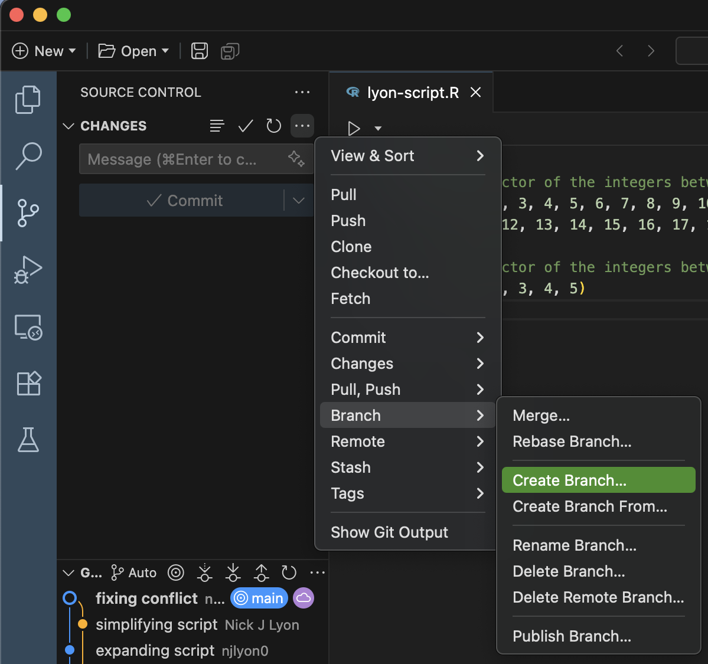{fig-alt="Screenshot of the dropdown menu in Positron for creating a new branch" fig-align="center" width="80%" .lightbox}

In the resulting field (top middle of Positron), **give your new branch an informative name.** In this example we haven't given our new branch a great name but in a "real" repository you will greatly appreciate having concise but descriptive branch names. Once you're happy with the name, **hit the Enter key on your computer.**

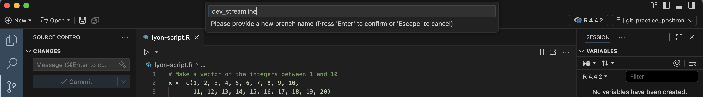{fig-alt="Screenshot of the field in Positron where you type new branch names" .lightbox}

Now that you've made your new branch locally, you need to send it up to GitHub. Positron calls this "Publishing" but this isn't conceptually different from any other sync/push--essentially you're just letting GitHub know that you have a branch locally that it doesn't have a record of yet. To publish the branch, **click the "Publish Branch" button.**

{fig-alt="Screenshot of the Positron 'source control' pane where the 'Publish Branch' button is active" fig-align="center" width="80%" .lightbox}

You'll know that this worked when you look at the branch diagram in the bottom left corner of Positron's source control menu. Note how the second commit from the top has the "origin/main" label while the top-most one has the label that matches whatever you named your new branch.

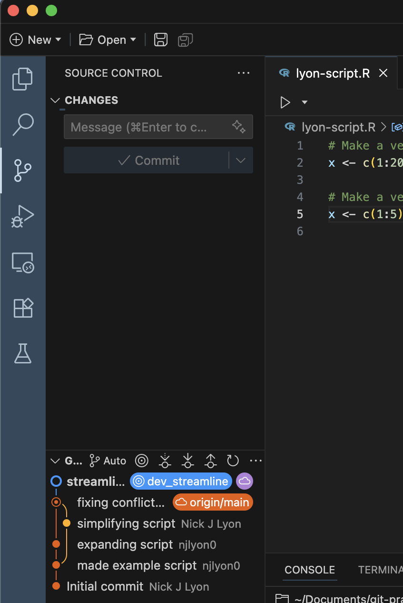{fig-alt="Screenshot of the Positron 'source control' pane after a new branch has been published" fig-align="center" width="80%" .lightbox}

### RStudio

To create a branch, click the **<span style="color:purple">purple</span>** button in the "Git" tab of RStudio that shows two rectangles connected by a diamond at right-angles from one another.

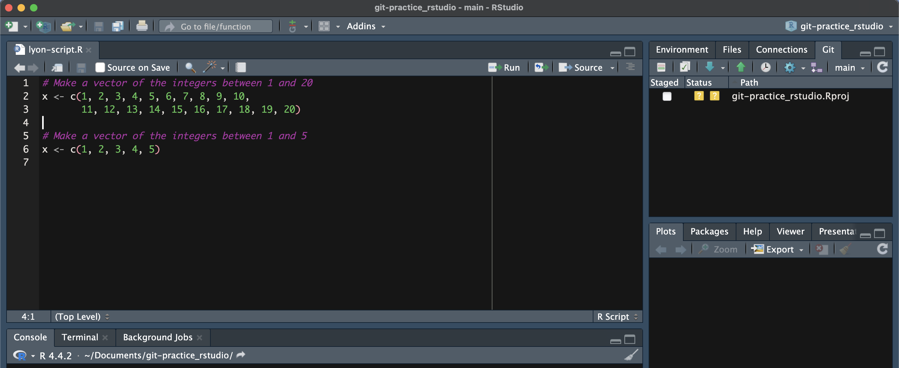{fig-alt="Screen capture of RStudio" .lightbox}

In the resulting dialogue box, **give your new branch an informative name.** In this example we haven't given our new branch a great name but in a "real" repository you will greatly appreciate having concise but descriptive branch names. Once you're happy with the name, **click the "Create" button** (you can ignore the other options and buttons on this dialogue box).

{fig-alt="Screenshot of the menu that opens when you click the purple 'create branch' button in RStudio. Includes a text field for the branch name as well as a some other checkboxes/options (that can be safely left at their default settings in many cases)" fig-align="center" width="50%" .lightbox}

This will create a confirmation message that is superficially similar to the format of messages returned by other Git actions.

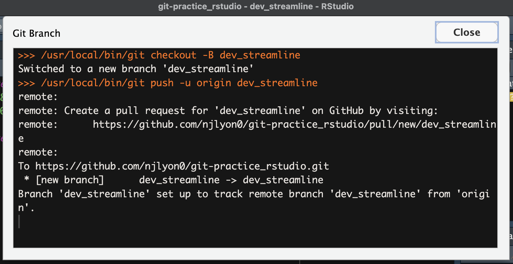{fig-alt="Screenshot of the text returned when you create a branch in RStudio" fig-align="center" width="80%" .lightbox}

You may also notice that in your Git tab where previously it said "main" it now shows whatever name you chose for your branch.

:::

### Work in the Branch

You can now work in a branch *in the same way* that you work with GitHub via your IDE of choice when you are not using branches.

1. Make **<span style="color:gold">edits</span>**
2. **Commit** changes locally
3. **<span style="color:blue">Pull</span>** from GitHub to reduce the chances of a conflict
4. **<span style="color:green">Push</span>** your committed changes to GitHub

The reason you use the same workflow is--as previously stated--even if you don't typically use branches, all work in Git is functionally done in the "main" branch of your repository so your work in this new branch should use the same order of operations as work done in the "main" branch.

### Open & Merge a Pull Request

When you are done with your work in the branch, you will want to merge your new branch with the "main" branch of the repository. This branch merging is most easily done via GitHub so the following instructions are agnostic to IDE and purposefully exclude the repository name from the screen capture area. To start, **<span style="color:green">push</span>/sync your final commit(s) from your local branch with GitHub.**

After you <span style="color:green">push</span>/sync your changes, GitHub should recognize this and automatically create a button at the top of your repository's home page for you to start the process of creating a "pull request." Pull requests are how you merge branches on GitHub and the entire process is conducted entirely in the browser so we'll leave our IDEs until the pull request is completed.

To start the branch merging process, **click the "Compare & pull request" button**

{fig-alt="Screenshot of a repository in GitHub where the 'compare and pull request' button is being offered because GitHub detected a push in the branch" fig-align="center" width="80%" .lightbox}

You will then be prompted to write a title and message for your pull request to give some broader context for what the branch does. This is especially valuable if you are not the one reviewing pull requests as this can help someone quickly familiarize themselves with what you have done.

Once you're satisfied with your title and message, **click the "Create pull request" button.**

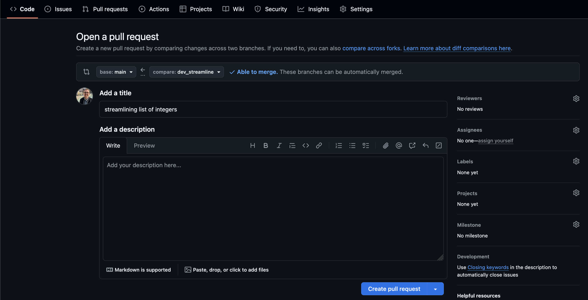{fig-alt="Screenshot of GitHub when you open a pull request and are prompted to give it a title and description" .lightbox}

That done, GitHub will send you to a page that looks very much like a GitHub issue (see the module on issues for more detail). At the top is whatever title and message you just wrote when opening the pull request following by a list of all of the commits in that branch.

Those commits are hyperlinks in case you want to view the specific differences to files edited in this branch.

Note also that if you realize you forgot to do something in your branch (or if someone asks you change something) you can return to your IDE and commit/pull/push and it will automatically update on the pull request. Pull requests are for merging a whole branch, not for merging just a part of the work in the branch.

You or your team can also post messages on a pull request as needed (see the text box at the bottom of the below picture). If you are ready to merge a pull request from your branch into the "main" branch **click the "Merge pull request" button.**

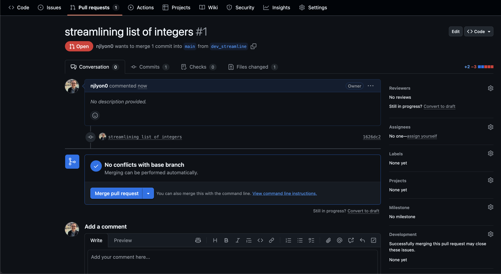{fig-alt="Screenshot of an open pull request on GitHub" .lightbox}

GitHub will open another text box where you can add a commit message to your acceptance of the pull request. If whoever opened the pull request was sufficiently detailed in their opening comment(s) this may not need to be terribly detailed but it can't hurt!

Once your message is written, **click the "Confirm merge" button.**

{fig-alt="Screenshot of the menu that opens on GitHub when you click 'merge pull request' where you are prompted to add an optional description before clicking 'confirm merge'" .lightbox}

Your pull request has now been merged! Now we need to do some minor housekeeping in GitHub that--fortunately--GitHub makes really accessible.

### Post-Merge Housekeeping

Branches are meant to be short-lived and deleted once the specific purpose for which they were created has been accomplished. So, once the pull request is merged, we should **click the "Delete branch" button.** This will ensure that the number of active branches remains manageable and also will let you re-use branch names later on if you deem that necessary.

{fig-alt="Screenshot of a closed pull request on GitHub with a 'delete branch' button provided" .lightbox}

After you click "Delete branch" it will be replaced by a "Restore branch" button so you could always reclaim it if the deletion was premature.

{fig-alt="Screenshot of a pull request on GitHub after the 'delete branch' button has been clicked and replaced by a 'restore branch' button" .lightbox}

Finally, if we return to the home page of the repository, we can see that the most recent commit is whatever we put in the pull request text field right before we merged it.

{fig-alt="Screenshot of a the home page of a GitHub repository where the most recent commit matches the pull request commit message from an earlier screen capture" .lightbox}

### Update the Local Clone

Now that the branches have been merged on GitHub, we need to make sure our local clone gets those updates from GitHub. This is particularly important if our IDE is still in the branch we created earlier because--now that we've deleted the branch's counterpart in GitHub--we'll get an error if we attempt to push from that branch.

::::{.panel-tabset}

### Positron

First, in the "source control" part of Positron, **hover over the "Changes" menu and click `...`** to expand the set of Git operations that are visible. In the resulting dropdown, **scroll down and click "Checkout to...".** Note that you may want to close your open files before doing this, particularly if some files were created in the branch because they wouldn't yet exist in the "main" branch locally (you merged on GitHub with the pull request but haven't pulled those updates locally).

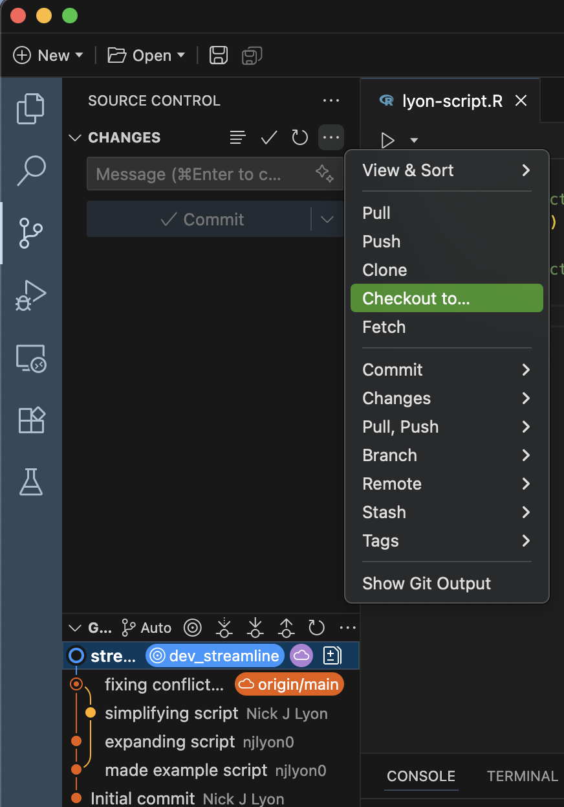{fig-alt="Screenshot of the Git operations dropdown menu in Positron with the 'checkout to...' menu highlighted" fig-align="center" width="50%" .lightbox}

This should open up a list of the available branches in the top middle of Positron. **Find the "main" branch in the list of available branches and click it.**

{fig-alt="Screenshot of the Git operations dropdown menu in Positron" fig-align="center" width="80%" .lightbox}

Now that you're back in the "main" branch, **pull the latest changes from GitHub.** You should receive all of the commits that you just merged via pull request earlier.

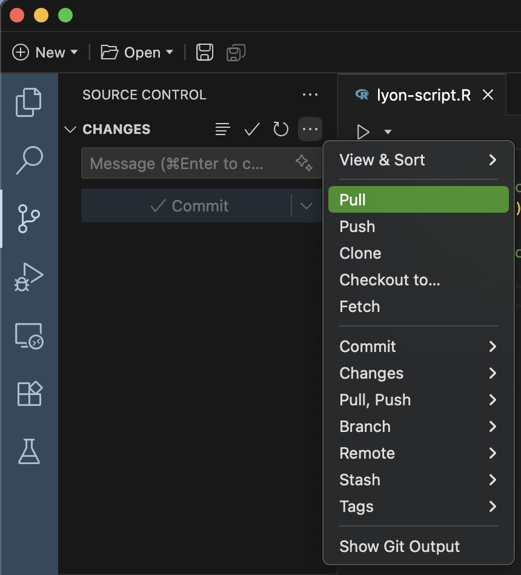{fig-alt="Screenshot of the Git operations dropdown menu in Positron with the 'pull' menu highlighted" fig-align="center" width="50%" .lightbox}

You will know this was successful when you **look at the branch diagram at the bottom of the "source control" menu** and see that the line for your experimental branch now re-connects to the leftmost branch's line.

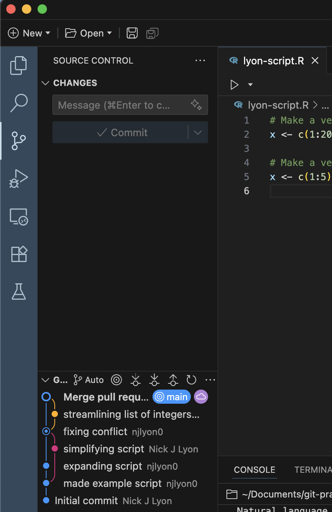{fig-alt="Screenshot of the branch diagram in Positron's source control menu" fig-align="center" width="50%" .lightbox}

### RStudio

First, in the top right corner of RStudio, **click the active branch name and switch to back to the "main" branch.** Note that you may want to close your open files before doing this, particularly if some files were created in the branch because they wouldn't yet exist in the "main" branch locally (you merged on GitHub with the pull request but haven't pulled those updates locally).

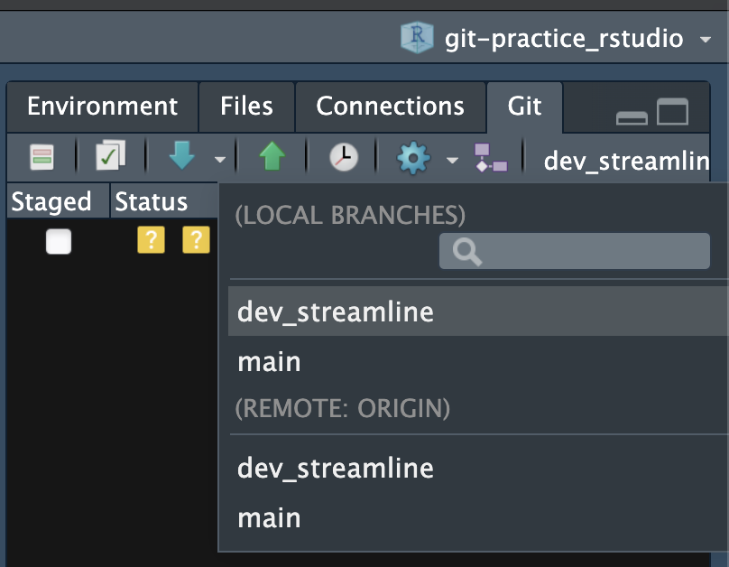{fig-alt="Screenshot of the Git branch dropdown menu in RStudio" fig-align="center" width="50%" .lightbox}

This should create a message that looks like the following image. You should **ignore the part of the message telling you that your are up to date**; you are not up to date with GitHub yet. The message is referring to the status of your local clone's version of the "main" branch.

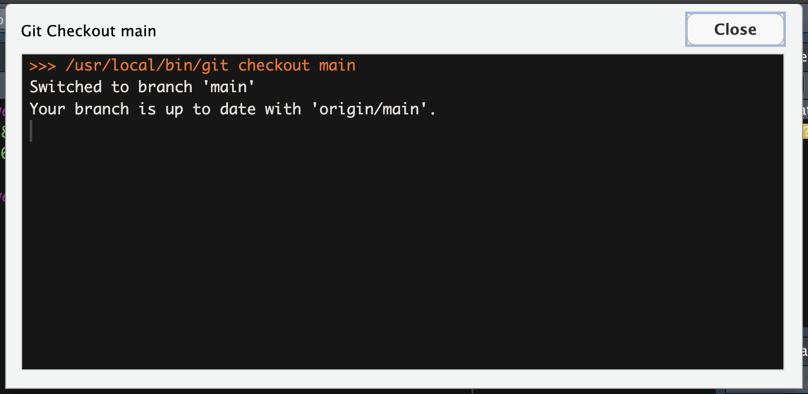{fig-alt="Screenshot of the Git message in RStudio when switching branches" fig-align="center" width="80%" .lightbox}

Now that you're back in the "main" branch, **pull the latest changes from GitHub.** You should receive all of the commits that you just merged via pull request earlier. This will create a message that is something like the following image--though of course it will list all changed files so it may be a longer message than what is pictured below if you edited more files.

{fig-alt="Screenshot of the Git message in RStudio when switching branches" fig-align="center" width="80%" .lightbox}

::::

### Branch Housekeeping

Now that our "main" branch is updated, we need to do the same sort of branch housekeeping that we did in GitHub after merging the pull request. In your IDE's  Terminal, **delete the finished branch with the following command line code.** _Remember to replace "BRANCH_NAME" with whatever you named your branch!_

```
git branch -d BRANCH_NAME
```

Once you've deleted that branch, you'll need to "prune" your branches. The previous code deleted the local version of your branch but your IDE still 'thinks' that GitHub has an equivalent of the branch. To reduce the potential for confusion, **prune your local clone with the following command line code.** Just like branch deletion, this should code should be run in the  Terminal.

```
git remote update origin --prune
```

Once you've run those two lines of code, confirm that it worked by following the below instructions for your IDE!

:::{.panel-tabset}

### Positron

Click the "Checkout to..." button in the dropdown menu of Git operations. The resulting list of branches should only list the "main" branch under each sub-heading.

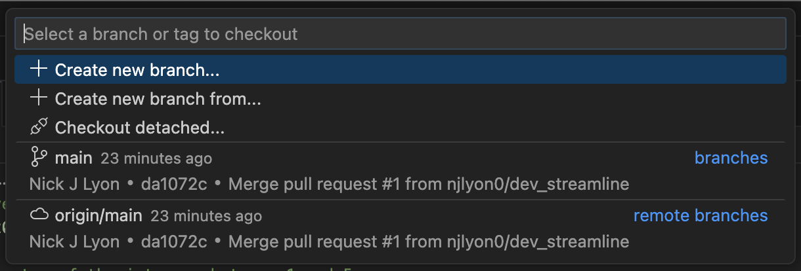{fig-alt="Screenshot of the Git branch dropdown menu in Positron" fig-align="center" width="80%" .lightbox}

### RStudio

Click the "main" branch name in RStudio's Git pane. The resulting dropdown of local and remote branches should only list the "main" branch under each sub-heading.

{fig-alt="Screenshot of the Git branch dropdown menu in RStudio" fig-align="center" width="50%" .lightbox}

:::

## Fork Workflow

Forking is (arguably) one of the more straightforward GitHub operations but before we cover it in detail, let's review the broader context. **You should only make a fork if _all_ of the following are true:**

- You don't have edit access to the original repository (and can't reasonably ask for it)
- Your work can't be done in a branch
- It is unlikely that any edits you want to make will/should ever be integrated back into the original repository

If you're confident that a fork is warranted:

1. From the GitHub landing page for the repository, click the "Fork" button
2. Clone your fork of the repository
3. Work in your fork as you would normally with Git
4. If warranted, open a pull request to merge your edits back into the original repository

Note that in many cases, you won't do step 4 and in some cases you may not even do step 3. For example, some people fork repositories that have key resources (e.g., education materials, non-CRAN R packages), just so they can guarantee that those resources stay available to them; even if the original repository is deleted/archived, your fork remains safe and active!

{fig-alt="Graphic of the workflow when using forks. Begins by forking someone else's repository then working in your fork as you normally would" fig-align="center" width="75%" .lightbox}

### Create a Fork

To start, **go to the repository landing page for the repo you want to fork.** In the top right of the repository's GitHub page there is a "Fork" button (between "Unwatch" and "Star"), click it to begin forking.

{fig-alt="Screenshot of the top of a GitHub repository including the 'fork' button in the top right (in-line with the name of the repository)" .lightbox}

This redirects you to a page that is very similar to the page for creating a new repository _de novo_.

Here you can select who you want to own the repository from a dropdown including any organizations you are a member of and your username if you want to personally own the fork. You can also change the repository name (though the default is to retain the same name) and add a description of your purpose for the fork.

You may notice that in this page you do not have the option to specify public versus private or any of the 'initialize' steps (e.g., README, gitignore, or license). Forks will inherit these settings from the repository they are forked from so they do not need to specified here.

Once you are happy with the owner of the fork, the name, and the description, click the <span style="color:green">green</span> "Create fork" button.

{fig-alt="Screenshot of the GitHub interface for making a fork (where the repository can be renamed and have a description added)" .lightbox}

Depending on the amount of content in the repository you are forking and your internet speed this may take anywhere from a few seconds to 1-2 minutes so you may need to wait for a moment while GitHub creates a new duplicate repository under the control of the owner you specified.

After the process completes the page will refresh and you will find yourself on the landing page for your new forked repository!

{fig-alt="Screenshot of the forked repository owned by a different owner than the original repository" .lightbox}

This repository has a fork icon in the top left (to the left of the owner/repository name) and includes a link to the repository that it came from just beneath that. 

There is also a new status bar indicating how 'ahead of' or 'behind' the fork is relative to the original repository. If the "parent" repository is updated (i.e., someone pushes changes to it after you forked) you can click the "Fetch upstream" button to integrate those changes with your fork.

From here on you can work within your fork as you would within any other repository! **<span style="color:purple">Clone</span>** the fork into your local computer and work as you normally would.

If you decide that your changes are a meaningful improvement that the parent repository could benefit from, you can click the "Contribute" button to begin the process of submitting a pull request to integrate your edits with the parent.

## Git Resets

What if you make a commit that you want to _undo_ (i.e., remove from your repository's history)? Git offers a command known as a "reset" to undo commits. There are three levels of severity to a reset; see the table below for more details on each.

:::{.callout-note icon="false"}
### When a Reset is Warranted

If you want to undo a commit for merely cosmetic reasons, consider just leaving it as-is, but if you commit sensitive information or large files, or attach an incorrect commit message, undoing a commit can be a useful solution.
:::

| Reset Type | Un-Does Commit | Un-Stages File(s) | Discards Changes | Use-Case |
|:-:|:-----:|:-----:|:-----:|:---------------------|
| <span style="color:#c77dff">**Soft**</span> | **Yes!** | No | No | You make a commit but want to edit a typo in the commit message |
| <span style="color:#9d4edd">**Mixed**</span> <br>(Default) | **Yes!** | **Yes!** | No | Your commit included files you actually didn't mean to include at all (or at least not in that commit) |
| <span style="color:#5a189a">**Hard**</span> | **Yes!** | **Yes!** | **Yes!** | This is a "scorched earth" solution that is _highly_ situational |

<br> 

Once you've chosen the type of reset that you need, you can use the following syntax to execute it. Note that this is  Command Line code that must be run in the "Terminal" pane of Positron/RStudio.

:::{.panel-tabset}
### Reset the Most Recent Commit

To undo just the most recent commit:
```
git reset --soft HEAD~1
```

### Reset to a Specific Commit

To undo every commit after a specific commit, you can use the target commit's "hash" (unique letter/number string identifying that commit). This method does not care how long ago the target commit was so use with caution!

```
git reset --mixed <commit-hash>
```

**It is _much_ safer to just roll back one commit at a time** until you're happy with how things look than it is to use this approach!
:::

### Finding a Particular Commit

Before you can reset to a specific commit, you need to be able to find the "hash," and even if you just want to roll back one commit, it's probably a good idea to take a quick glance at what that commit actually included before un-doing it!

To see your most recent commits (in reverse chronological order), you can run the following  Command Line code.

```
git log --oneline
```

**The commit hashes are the 7-character letter/number strings** (e.g., `f3b8b9a`) on the left of the output from the command above.

A similar view can be found in GitHub by checking out the commit history of your remote repository but if you're trying to un-do a commit that you _haven't_ pushed, GitHub can't show you that commit.

### Local vs. Remote Commits

All of the above only affects _local_ commits (i.e., commits that have not been synced/pushed). If you realize that you want to undo a commit that you've already pushed to GitHub, you'll need to both reset the commit and "force" push back to GitHub to get the remote repository to reset in the same way.

```
git reset --hard HEAD~1
git push --force
```

### Re<u>set</u> vs. Re<u>vert</u>

If resetting feels too extreme, you could also revert a commit. **Reverting moves the status of all files back to what they were under a particular commit but <u>retains the full commit history</u>--including commits made after that focal commit.** You can then make a new commit where you officially change files back to that old status but you don't lose the history of the changes you now skip over as you would with a reset.

To revert a repository:

```
git revert <commit-hash>
```
