<!---
Old (as of June 2026) GoogleSlides deck on this topic here: https://docs.google.com/presentation/d/1-DHMTlneOTZXYFDTzzS6ycaLbfLmSHQpXQzNKb_pVYA

Slide deck embed code (vvv)

 
<iframe width="560" height="380" src="https://docs.google.com/presentation/d/1-DHMTlneOTZXYFDTzzS6ycaLbfLmSHQpXQzNKb_pVYA/preview?" frameborder="0" allowfullscreen></iframe>

 
--->

:::{.callout-tip icon="false"}
###  Learning Objectives

After completing this session, you will be able to:

- Define an issue in the context of GitHub
- Create a new issue in an existing repository
- Explain considerations for creating a useful, appropriately-scoped issue
- Define a project in the context of GitHub
- Explain in what contexts Projects are useful
- Identify the three available project view options
- Explain how issues can get added to projects

:::

## What Is an Issue?

Issues are a convenient way of identifying and delegating tasks **within a single repository** as well as documenting progress over time. They can also be used as a digital lab notebook for personal use to brainstorm on a novel topic or preserve important links or supplementary material for easy distribution across a whole team.

Importantly, <u>while issues can definitely be helpful they are _not_ required to successfully use GitHub for collaborating as a team</u>. Issues absolutely have the potential to facilitate division of labor within a team though and are thus worth covering in this training.

An additional function that may be outside of the scope of what you need to use within your team is that it allows non-members to flag issues that they've had with code written by your team or request additional functionality that doesn't yet exist in your framework. Depending on your use of packages in R you may have already opened an issue on an existing R package or workshop materials hosted in GitHub to do just that!

To see a more complete example of how issues can be used we can examine the open issues of an established R package.

### Example Issue

Below is the GitHub landing page for the `googldrive` package and you can see that next to the underlined "Code" tab is an "Issues" tab with a gray circle with the number 22 in it. This number notifies us that as of this screen capture, there were twenty two open issues on this package's GitHub repository.

{fig-alt="Screenshot of the GitHub repository for the 'googledrive' R package with many open issues"}

If you click over to the issues tab you will see the titles of all current "open" (i.e., ongoing) issues on the repository. Each issue has a title and beneath that a unique number following a `#` as well as how long ago the issue was opened and the GitHub username of the person who opened the issue. On the right side of each issue's thumbnail you can see the number of comments added to it.

{fig-alt="Screenshot of the issues tab of the 'googledrive' R package"}

Comments can be used to have a full dialogue among different users -- potentially both in and outside of the team responsible for managing the code! The conversational aspect of issues can make them functionally similar to an email thread or messaging app chain. This communication can help keep the solutions to tasks well-documented while ensuring that every member of your group can have their voice heard.

{fig-alt="Screenshot of the conversation between a user and a package maintainer in a particular issue"}

## Finding Issues in a Repository

Before we get into creating our own, it'll be helpful to cover where issues live in GitHub. If you go to the landing page of any repository, you'll see the--perhaps familiar--facets of the code component of GitHub: the repository's name, the most recent commit, the files and folders in the repository, and so on.

If you look **above the repository's name** you'll see that all of this information is actually just one tab of the repository (labeled " Code"). Note the **orange** underline of that tab in the screen capture below.

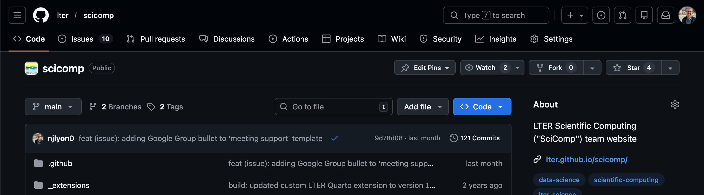{fig-alt="Screenshot of the landing page of a GitHub repository"}

The next tab over is labeled " Issue", **click that tab!** You should now see the list of all issues in the repository. As we can see in the screen capture below, the most recent few issues (sorted to the top, just like commits), are focused on a cohort of LTER SPARC groups.

If we look just above the first issue we can see that 10 issues are "open" (i.e., active) and 90 are closed. By default only the open ones are displayed. Your group may not need that many issues so don't worry too much about how many you've got!

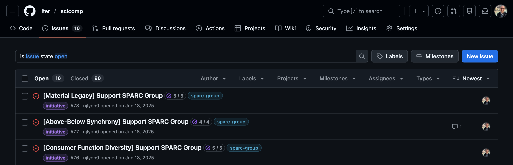{fig-alt="Screenshot of the 'issues' tab of a GitHub repository with a number of open issues displayed"}

### What If There Aren't Any Issues?

If you click into the 'Issues' tab of a repository that doesn't have any, you'll get a screen like the following screen capture. Note that other than the absence of issues, the screen looks the same as when there are issues (i.e., the same buttons and search/filter fields are still available).

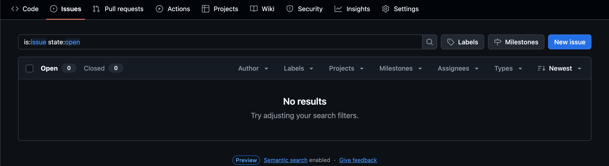{fig-alt="Screenshot of the 'issues' tab of a GitHub repository with no issues (either open or closed)"}

## Creating an Issue

Let's open a new issue to demonstrate some of the useful features they provide. **Click the "New issue" button** to begin. This will open a dialog menu where we can begin to create our issue. Let's **start by adding a title and then clicking the "Create" button.** We could do more setup stuff through this window but let's start with the bare minimum for demonstrative purposes.

:::{.callout-important icon="false" collapse="true"}
### "Meta" Screenshot Acknowledgment

You may recognize that the issue used in this demo is about improving the module you are currently working through. We hope that isn't distracting but it felt more efficient to improve this module and document the process for use in it at the same time than invent a fake issue while also needing to document our process for improving this part of the workshop.

:::

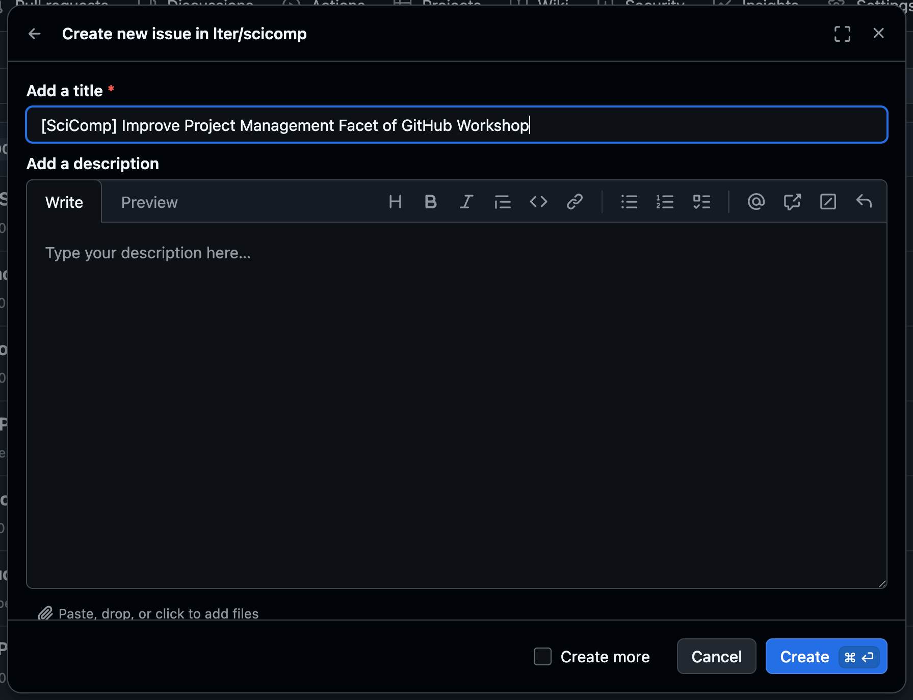{fig-alt="Screenshot of the dialog menu in GitHub when you start to create a new issue with only a title filled out" fig-align="center" width="75%"}

Clicking "Create" should automatically redirect you to the page for your new issue. It will automatically be given a unique (to this repository) number that you can see next to the issue's title at the top of the screen. We'll get to why the issue number is useful later.

**There are two main categories of useful information in an issue: comments and metadata.** Comments take up the majority of the horizontal area (see the wide left column) while metadata information occupies a thin column on the right side of the screen.

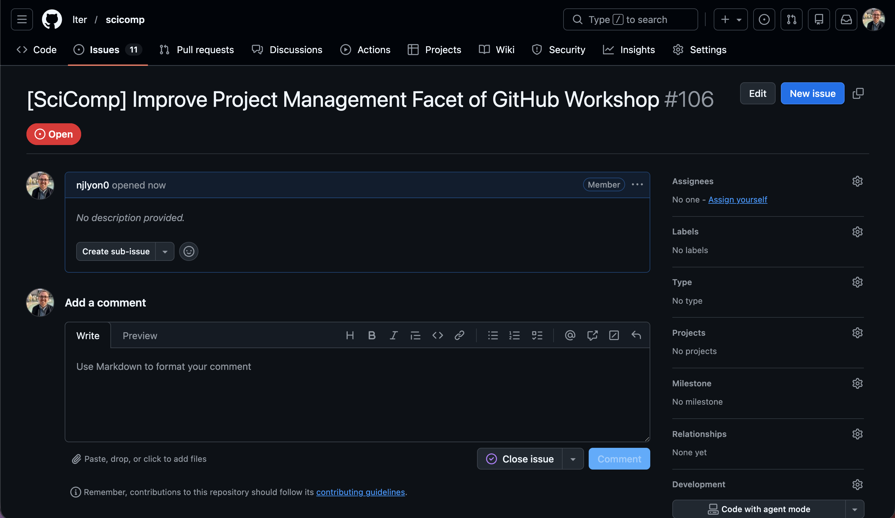{fig-alt="Screenshot of a newly-opened GitHub issue with only a title filled out"}

### Metadata

When we create issues, we like to **start with the metadata** as this information is more useful when thinking things through from a strategic project management perspective. To clarify, the comments are also useful but they are specific to the task at hand, **the metadata allow you to categorize how this issue supports the larger vision for the project.**

The three facets of an issue's metadata that you're most likely to use are:

1. Assignees
    - These people will get email notifications of all activity in the issue
2. Labels
    - Categorical descriptors for what kind of issue this is. These can be customized and have been heavily customized in the screen captures to follow
3. Type
    - An interesting step one level "above" labels. The example below uses the Agile software development framework, but--like labels--you can customize these to fit your group's needs (for more info on Agile see [here](https://en.wikipedia.org/wiki/Agile_software_development))

Let's customize those three fields for the issue we just opened. To customize any part of issue metadata **click the gear icon to the right of the field you want to edit.** That will open a list of possible options for that field so you can just choose the one(s) that apply to this issue. After you've selected some information for the issue's metadata, your sidebar might look like the screen capture below.

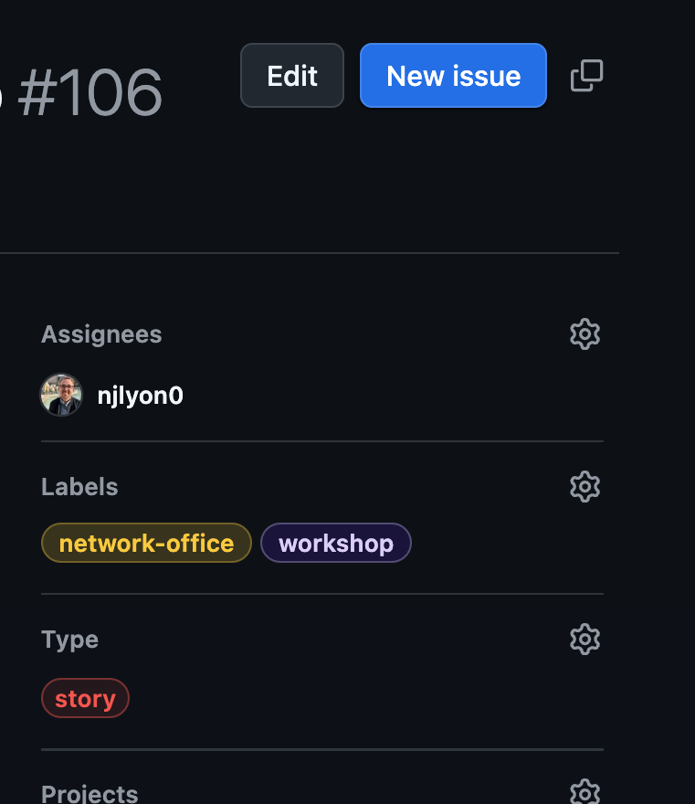{fig-alt="Screenshot of the metadata sidebar of a GitHub issue with some fields filled out" fig-align="center" width="40%"}

### Comments

Once you're happy with the metadata, we can edit the first comment. "Edit" not "make" because the first comment is actually the field below the title that we left blank when we opened the issue initially. To edit that comment, **click the ellipsis (...) in the top right corner of the first comment and select the " Edit" option.** Note that GitHub issues accept Markdown syntax so any tips or tricks you've picked up in styling the plain text of RMarkdown or Quarto files should also apply to beautifying your issue.

:::{.panel-tabset}
#### Finished Comment

After you've edited your issue's first comment it might look something like this.

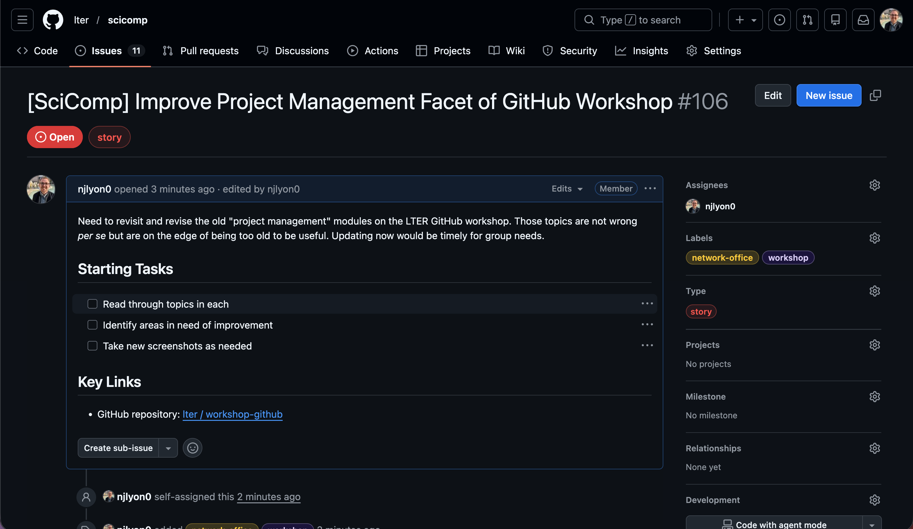{fig-alt="Screenshot of an issue with an edited top-level comment and some metadata filled out"}

#### Markdown 'Behind the Scenes'

This is the 'back end' of the issue displayed in the other tabset panel. Note the Markdown tricks being applied for both form and function purposes.

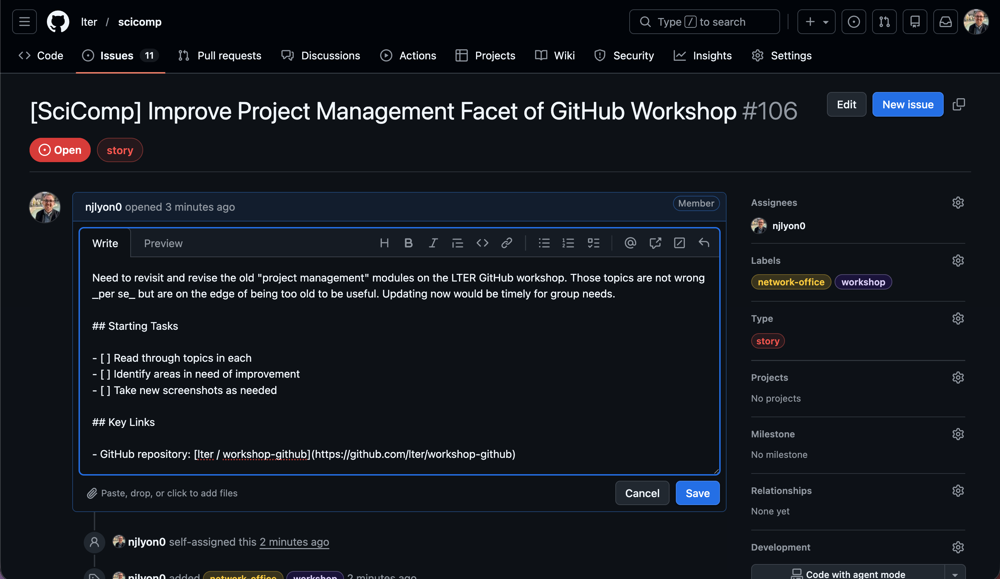{fig-alt="Screenshot of an issue comment being edited with Markdown syntax"}

:::

While issue comments are completely free for you to use as you see fit, it is important to remember that _your most frequent collaborator is yourself in the future_ so a future version of yourself will absolutely thank you if you **include as much useful context as possible.** In a team setting like this one, extra detail can also really help when the person opening the issue is not the person responsible for editing the code to address it.

## Inter-Issue Relationships

While technically a facet of the metadata, it is worthwhile to make some specific time to discuss issue "relationships." Once you have a number of issues open, it's likely that some of them will be related! Possibly because one requires another to be completed before it can be started or maybe a number of small tasks all support a single, larger task.

Whatever the specifics, you can formally enshrine this in GitHub by editing a piece of the issue's metadata in the right sidebar beneath most of the other issue metadata elements. **The "Relationships" piece is towards the bottom of the metadata sidebar** (just beneath "Milestone").

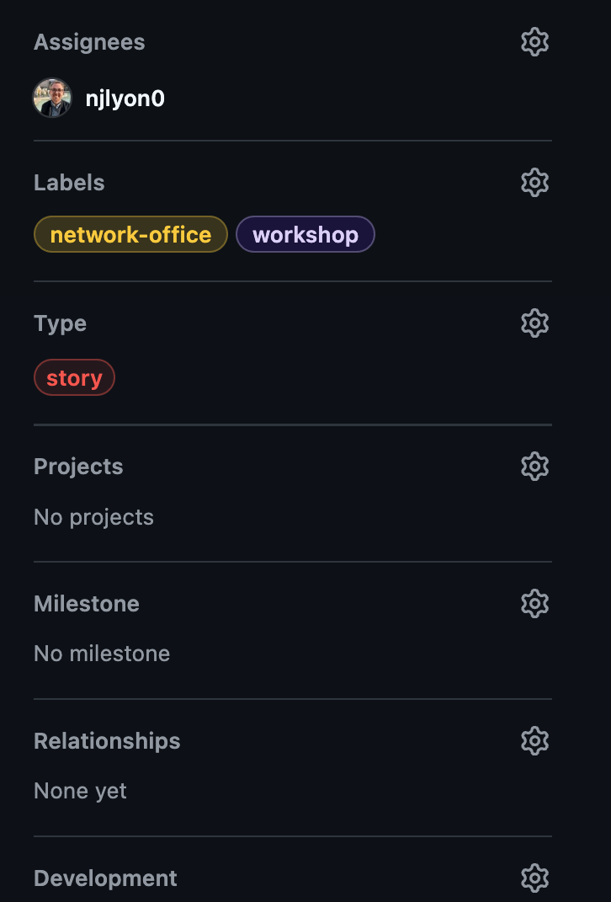{fig-alt="Screenshot of the metadata sidebar of a GitHub issue" fig-align="center" width="40%"}

Once you find it, **click the gear icon.** For synthesis working groups, "Add parent" is likely to be the most useful but if you want to add one of the other types of relationship instead, you absolutely can! Note that _each issue can only have one parent_, though you can change that relationship to a different issue if need be.

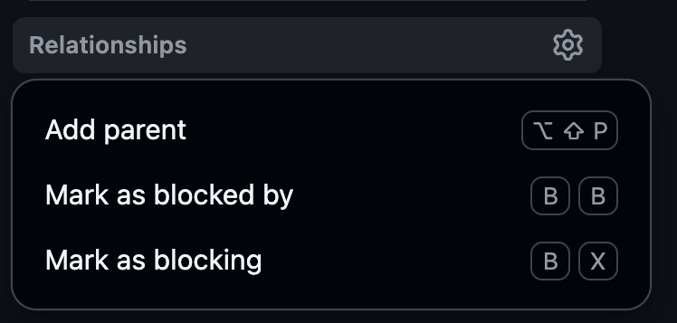{fig-alt="Screenshot of the 'issue relationships' dropdown menu in GitHub with 'Add parent', 'Mark as blocked by' and 'Mark as blocking' as options" fig-align="center" width="40%"}

Regardless of the type of relationship you pick, you will now be in a dropdown menu with all the issue in this repository as options to be added as in-relationship with your current issue. You can either scroll through this list or type words that are in the title of the issue with which you want to connect your current one.

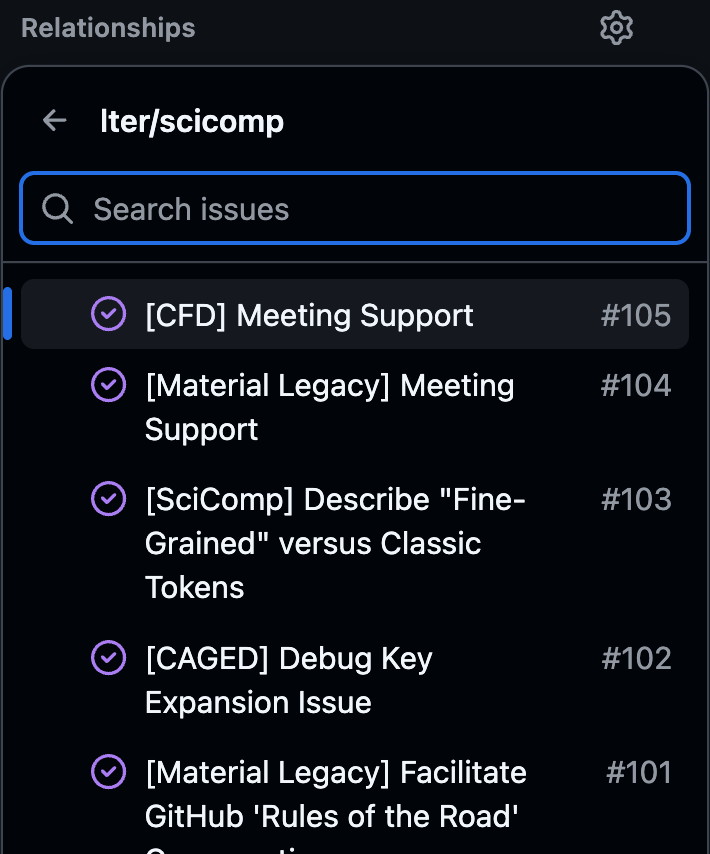{fig-alt="Screenshot of GitHub issue 'relationship' dropdown open showing a selection of recent issues in the same repository" fig-align="center" width="40%"}

After you select one, the "Relationships" heading should clearly state which issue this one is linked with and if you click it, it will direct you to that other issue.

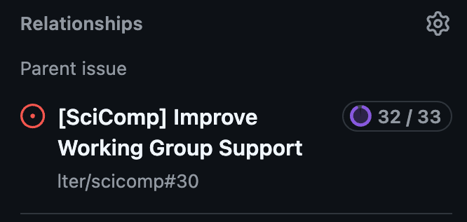{fig-alt="Screenshot of a GitHub issue with a linked parent" fig-align="center" width="40%"}

If you do visit the other issue, you can see all of its sub-issues in a convenient list beneath the first comment of that issue. It may look something like the following:

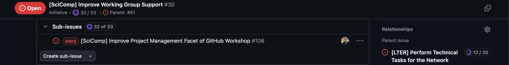{fig-alt="Screenshot of a GitHub issue with at least one sub-issue"}

### Working Group Use-Cases for Nesting Issues

Some use-cases of this feature for working groups include the following:

:::{.panel-tabset}
#### Findable Documentation

Easily find all issues related to a topic (even closed ones) by **having a parent issue that is never closed**--even when all of its sub-issues are closed. In this instance, your issue structure might look like the following diagram.

In the diagram below, open issues have a  while closed issues have a .

::::{.columns}
:::{.column width="55%"}
 Group Repository  
&nbsp;|--  **Data Discovery (#1)**  
&nbsp;|&nbsp;&nbsp;&nbsp;&nbsp;|--  Find Equatorial Data (#2)   
&nbsp;|&nbsp;&nbsp;&nbsp;&nbsp;|--  Identify Spatial Data Source (#3)   
&nbsp;|&nbsp;&nbsp;&nbsp;&nbsp;&nbsp;L&nbsp;  Find Trait Data (#5)    
&nbsp;|--  **Quality Control (#4)**  
&nbsp;|&nbsp;&nbsp;&nbsp;&nbsp;|--  Files without years (#6)   
&nbsp;|&nbsp;&nbsp;&nbsp;&nbsp;|--  Relative Abundance Data (#7)  
&nbsp;|&nbsp;&nbsp;&nbsp;&nbsp;&nbsp;L&nbsp;  Identify Spatial Data Source (#8)    
&nbsp;&nbsp;L&nbsp;  **Analysis Judgment Calls (#9)**  
&nbsp;&nbsp;&nbsp;&nbsp;&nbsp;&nbsp;&nbsp;|--  Distance/Dissimilarity Metric Options (#10)   
&nbsp;&nbsp;&nbsp;&nbsp;&nbsp;&nbsp;&nbsp;|--  Normalize data? (#11)  
&nbsp;&nbsp;&nbsp;&nbsp;&nbsp;&nbsp;&nbsp;&nbsp;L&nbsp;  Analyze within or across ecosystem (#12)    

:::
:::{.column width="45%"}

\

By leaving the parent issues open (in this example, numbers 1, 4, and 9) all of the sub-issues are easily findable if one of these judgment calls need to be revisited (whether to change track or write the relevant portion of a manuscript).

:::
::::

#### Delegating Writing

Create **an issue for each manuscript section** and link actionable tasks for each underneath their respective parent. In this instance, your issue structure might look like the following diagram.

In the diagram below, open issues have a  while closed issues have a .

::::{.columns}
:::{.column width="55%"}

 Group Repository  
&nbsp;|--  **Introduction (#1)**  
&nbsp;|&nbsp;&nbsp;&nbsp;&nbsp;|--  gather references (#6)   
&nbsp;|&nbsp;&nbsp;&nbsp;&nbsp;&nbsp;L&nbsp;  Outline and draft section (#8)    
&nbsp;|--  **Methods (#2)**  
&nbsp;|&nbsp;&nbsp;&nbsp;&nbsp;|--  Review data wrangling/analysis code (#7)   
&nbsp;|&nbsp;&nbsp;&nbsp;&nbsp;&nbsp;L&nbsp;  Outline and draft section (#9)    
&nbsp;|--  **Results (#3)**  
&nbsp;|&nbsp;&nbsp;&nbsp;&nbsp;|--  Settle on final figures (#10)   
&nbsp;|&nbsp;&nbsp;&nbsp;&nbsp;&nbsp;L&nbsp;  Outline and draft section (#11)  
&nbsp;|--  **Discussion (#4)**  
&nbsp;|&nbsp;&nbsp;&nbsp;&nbsp;|--  Review results draft (#12)   
&nbsp;|&nbsp;&nbsp;&nbsp;&nbsp;&nbsp;L&nbsp;  Outline and draft section (#14)  
&nbsp;&nbsp;L&nbsp;  **Abstract (#5)**  
&nbsp;&nbsp;&nbsp;&nbsp;&nbsp;&nbsp;&nbsp;&nbsp;L&nbsp;  Draft section (#13)

:::
:::{.column width="45%"}

\

In this use-case, you can absolutely close parent issues after their sub-issues are all completed (see the "Methods" issue in the diagram above).

:::
::::

#### Sub-Team Work Plans

Make **an issue for each sub-team** then nest issues that _team_ is responsible for as children to that parent. In this instance, your issue structure might look like the following diagram.

In the diagram below, open issues have a  while closed issues have a .

::::{.columns}
:::{.column width="55%"}
 Group Repository  
&nbsp;|--  **Data Team (#1)**  
&nbsp;|&nbsp;&nbsp;&nbsp;&nbsp;|--  Fill out Data Inventory for all datasets (#4)   
&nbsp;|&nbsp;&nbsp;&nbsp;&nbsp;|--  Data Purgatory (#7)   
&nbsp;|&nbsp;&nbsp;&nbsp;&nbsp;&nbsp;L&nbsp;  Check taxonomic names (#8)    
&nbsp;|--  **Analysis Team (#2)**  
&nbsp;|&nbsp;&nbsp;&nbsp;&nbsp;|--  Analyze abundance data (#5)   
&nbsp;|&nbsp;&nbsp;&nbsp;&nbsp;|--  Multivariate stats for community comp. (#6)  
&nbsp;|&nbsp;&nbsp;&nbsp;&nbsp;&nbsp;L&nbsp;  Draft figures of core story (#9)    
&nbsp;&nbsp;L&nbsp;  **Writing Team (#3)**  
&nbsp;&nbsp;&nbsp;&nbsp;&nbsp;&nbsp;&nbsp;|--  Outline introduction and find sources (#10)   
&nbsp;&nbsp;&nbsp;&nbsp;&nbsp;&nbsp;&nbsp;&nbsp;L&nbsp;  Draft abstract for ESA (#11)    

:::
:::{.column width="45%"}

\

In this use-case, you likely wouldn't close the parent issues; or at least you wouldn't close them until that team was finished with all of their work.

:::
::::
:::

## Value of Issue Numbers

Earlier in this module, we promised to get into why the unique number of each issue is useful. Simply put, **you can reference issues in commits or in other issue by using their number!**

When you make a commit, add a hashtag/pound sign (`#`) and the number of the issue that you want to reference. This will have two key results.

:::{.panel-tabset}
### Issue Linked to Commit

Most directly, the **issue number in the commit message on GitHub will become a hyperlink to that issue.** Anywhere the commit appears (on GitHub), the issue will be linked and easily findable.

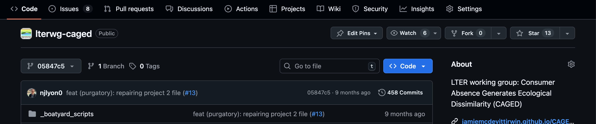{fig-alt="Screenshot of a GitHub repository where the most recent commit has an issue number that is a hyperlink"}

### Commit Appears in Issue

The other feature is a little less obvious in the moment but wonderful for documenting how issues and code edits can be in conversation with one another. The **commit message will show up in the comment history of the issue.** So, when you are scrolling through the comments of an issue, commits that reference that issue will be visible and in chronological order with the comments. So if one comment said "can you fix this?" there could be a commit immediately below it where the commit message is "fixed per #12".

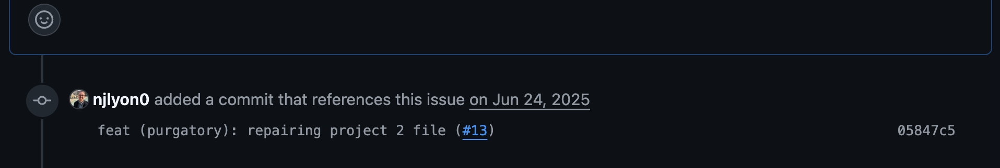{fig-alt="Screenshot of a commit message in the history of an issue because it included that issue's number"}

:::

**By leveraging this feature, you can greatly simplify your commit messages** because you can be confident that some of the necessary context and rationale are described in the issue and so do not need to be re-hashed in your commit message.

### Referencing Issue in Other Repositories

You can even reference issues in other repositories! However, the necessary syntax does change slightly. Once you adopt that syntax though, the referenced number would have the same behavior described above when referencing issues with commits in the same repository

- Commit referencing an issue in _the same repository_: `fix qc code per #12`
- Commit reference an issue in _a different repository_: `fix qc code per user/repo#12`

## Closing an Issue

When you're done with an issue, simply click the "Close issue" button. It will still be findable in your repository, it just won't show up by default when you go to the "Issues tab". In order to see all the closed issues on a repository, simply **click the Closed** button in the top left of the "Issues" tab of the relevant repository.

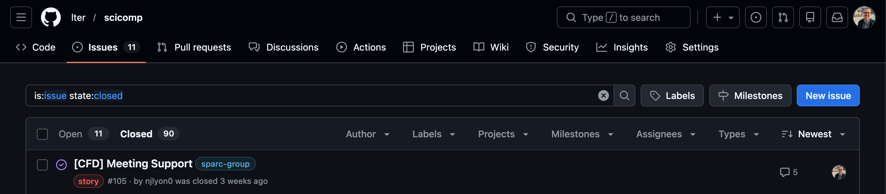{fig-alt="Screenshot of the closed issues section of a repository in GitHub"}

So, even if an issue was closed in the distant past of your repository on GitHub, you can still easily access and view all of its contents! This greatly facilitates the use of issues in tracking problem solving, brainstorm sessions, and supporting documents. 

## Appropriate Issue Scope

As a brief aside from the nuts and bolts of how to create and manage an issue, it is important to discuss appropriate issue scope.

Essentially, **an issue should directly correspond to either a single task or a single judgment call.** It is not always possible to predict how projects can evolve at the outset so you may find issues spanning multiple tasks despite your best efforts but as much as you can plan to keep a 1-to-1 ratio of tasks to issues you will find delegation and tracking of task completion that much easier.

Personally, I am a longtime believer in S.M.A.R.T. goals (i.e., goals that are **S**pecific, **M**easurable, **A**ttainable, **R**elevant, and **T**ime-specific), but there are many established ways of partitioning a larger project to achievable sub-tasks and you should use whichever is most intuitive to you.

If issues seem like something that your group is broadly interested in it may be worthwhile to have a conversation about some general 'rules of thumb' for the scope of tasks identified by issues.

:::callout-note
## Practice - Create an Issue

Now that we've covered what issues are and how to open them, let's take a minute and create some issues on your repository! On your GitHub repository, click over to the Issues tab and create a new issue. This can be either a placeholder just to have experience creating an issue or a real task that you think the team will have to deal with in the future. We are here if you need clarification!
:::

## What is a Project?

Projects are GitHub's primary _strategic_ project management tool. While issues can be very useful for particular tasks at a tactical, on-the-ground level, they are less valuable for making larger-scale plans and tracking evolving priorities. **A project acts as an umbrella that includes many issues** and tracks their inter-relationships and where they fit in a bigger-picture view of a project.

## Using Projects

Projects can be super useful, but they also include a non-trivial amount of setup and maintenance. So, **you should use a GitHub Project _only_ if <u>most</u> of the following applies to you:**

1. You use issues _extensively_
2. You use many metadata features within issues
    - E.g., assignees, labels, issue relationships
2. You have at least three repositories, all with their own issues
3. Project management is exciting to you

At the LTER SciComp team we use Projects extensively, but that's because all three of those statements apply to us! For many working groups, **using issues and issue metadata can be enough for the scale of their project.** However, if you do decide you want to use Projects, check out the information contained in this module!

## Project Ownership

**Projects can only be owned by a particular user or an organization.** In either case, any number of users can be allowed access to the project. The list of all projects owned by an organization/user can be accessed via the "projects" tab. Note that this tab's name is consistent for users and organizations; organizations just have more tabs to support the expanded set of tools available to them. Note that in the screenshot below we are in an organization ("lter") _not_ a specific repository.

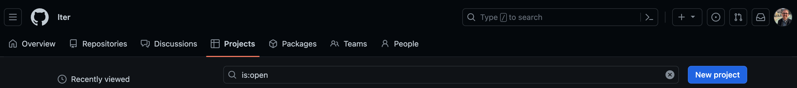{fig-alt="Screenshot of the 'projects' tab of a GitHub organization"}

Once a project has been created, **it can be "linked" to any number of repositories owned by the same entity.** This can be done from the "Projects" tab of each repository to which linking is desired. Note in the top left of the screenshot below that we are in a repository owned by the LTER GitHub organization.

{fig-alt="Screenshot of the 'projects' tab of a particular repository"}

## Using Projects

Within the team that created this workshop, we use issues to track and document the work that we do on behalf of working groups. Because there are so many issues spread across so many repositories, we are an ideal candidate to maximize the value of GitHub projects. See below for a screenshot of what our project looks like (as of early spring 2026).

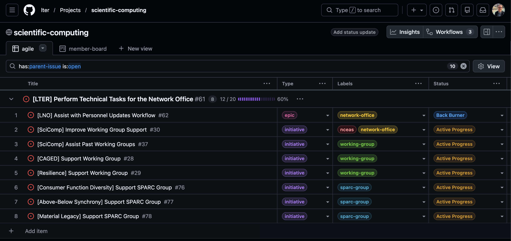{fig-alt="Screenshot of an open project in 'table' view with many open issues with a number of visible metadata fields as columns"}

Note that the issue above has the view set to nest issues beneath their parent issue because our team also extensively uses the issue "relationship" feature. See the issues module for more detail on that feature.

### Customizing Project Interface

You can change which metadata fields are visible, how issues are grouped or sorted, and even the project view itself by clicking the " View" button (top right corner) and customizing the options within the resulting dropdown menu. 

{fig-alt="Screenshot of the 'View' settings menu in a GitHub project" fig-align="center" width="50%"}

If you want, you can also add and customize multiple separate views in the same project! This is a great choice if your group includes a variety of thinking or learning styles and the separate tabs will all have the same issues included.

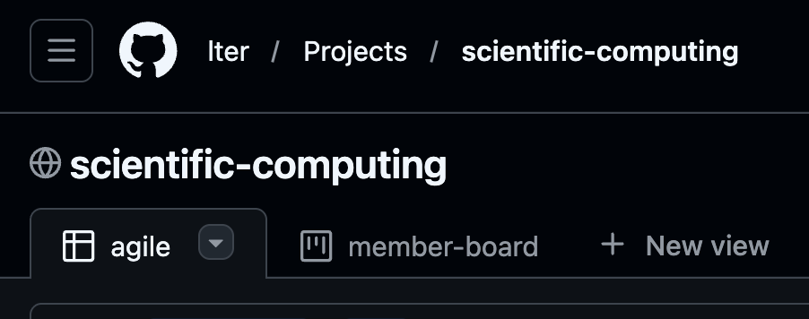{fig-alt="screenshot of the tabs at the top of a GitHub project" fig-align="center" width="60%"}

## Integrating Issues

After you make a project, you'll want to add issues to it! **You can either add issues to a project from the issue itself or from the project directly.** See the tabs below for instructions of either approach.

:::{.panel-tabset}
### From Issue

Adding an issue to a project can be done **from the issue's metadata options.** You can do this when you first create an issue or after the fact. In the screen captures below, we'll show how to do this with an existing issue.

To start, **go to the issue you want to add**. Once you're there, look at the metadata sidebar and **find the "Projects" section** (should be just above "Milestone" and just below "Type"). Next, **click the  gear icon** in the top right corner of that option.

This should give you a list of the projects that: (1) you have recently opened, or (2) are linked to the repository in which the issue lives. **Check the box next to the project to which you want to add this issue.**

{fig-alt="Screenshot of the metadata sidebar of a GitHub issue with the 'Projects' option open" fig-align="center" width="40%"}

Once you've chosen your project, the metadata sidebar should update to show which project the issue is now linked to. However, it adds a new sub-field called "Status" that likely says "No status". **"Status" is a project option that you can use to track the life-cycle of an issue.** The default options are "To Do", "In Progress", and "Done" but you can add custom ones if you want!

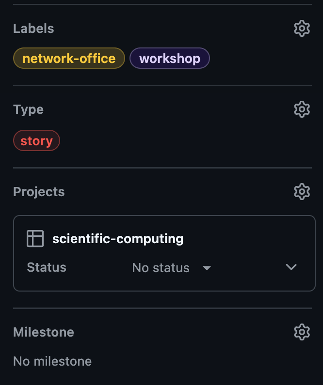{fig-alt="Screenshot of the metadata sidebar of a GitHub issue where a project has been selected but the status says 'no status'" fig-align="center" width="40%"}

**Click "No status" to see a dropdown menu** of statuses available in your project **and pick one from the list.** In this case, we'll pick "Active Progress" as we are currently working on this issue.

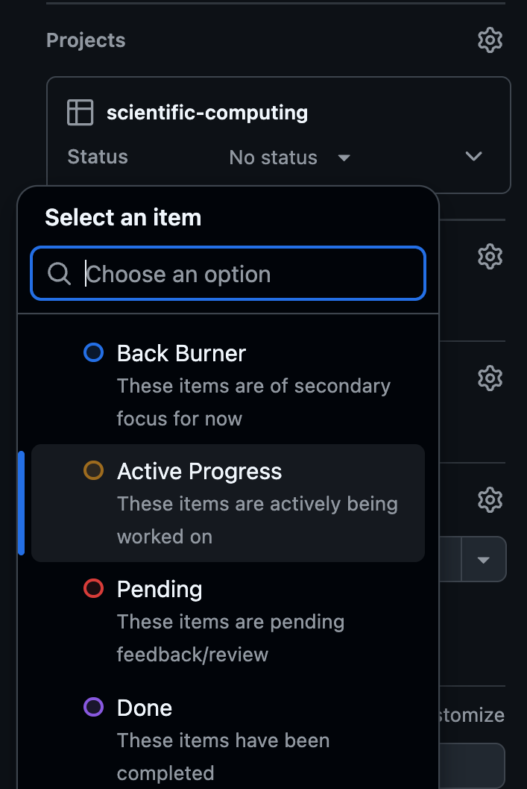{fig-alt="Screenshot of the metadata sidebar of a GitHub issue with the dropdown menu of available project status options expanded" fig-align="center" width="40%"}

Once you've done this, the chosen status should be visible in the metadata of the issue. If you change the status (either from the issue or from the project), it'll update here. The history of statuses of this issue will also appear in the chronological comments on the left sidebar of the issue.

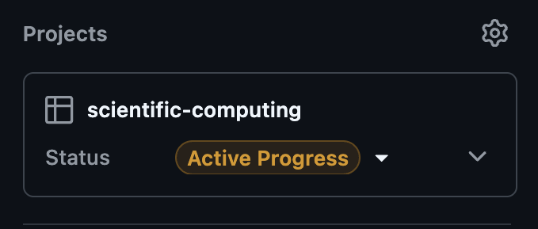{fig-alt="Screenshot of the metadata sidebar of a GitHub issue where a project has been selected and the status is 'Active Progress'" fig-align="center" width="40%"}

### From Project

Adding an issue to a project can be done **from the project itself** as well. This is a little more straightforward than adding from the issue as some pieces of data (e.g., project status) are specified implicitly depending on where in the project you add the new issue.

At the bottom of most project views, there should be a small  plus sign button. Click it and you'll be able to either (A) add a new issue that is attached to this project, (B) create a "draft", or (C) add an existing issue from a repository to which this project is linked. 

If you start typing the title of an issue, this dropdown menu should automatically update itself with issues in repositories linked to this project that have a partial match to what you are typing.

{fig-alt="Screenshot of the 'add item' menu in a GitHub project with some options on adding or making a new issue" fig-align="center" width="75%"}

A "draft" in this context is sort of a partial issue that is specific to projects and can't be created elsewhere. For the sake of clarity, we recommend either making a new issue or adding an existing one rather than using this somewhat ambiguous option.

:::

